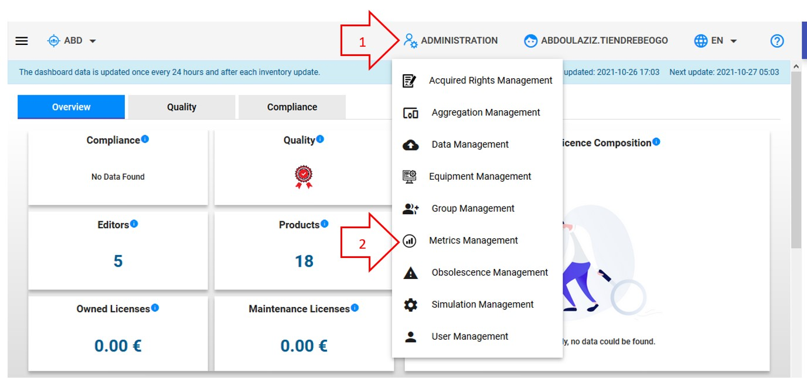
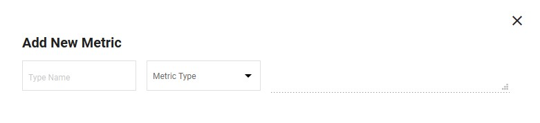
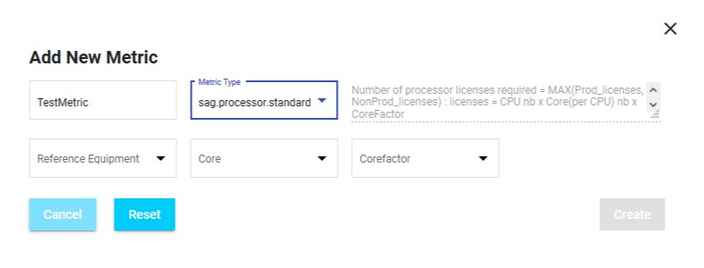

<link rel="stylesheet" href="../../../css/enlargeImage.css" />

# Create metrics

First, make sure that you are working on the good scope :

{: .zoom}

## Access to the page

If you want to create a new metric, you will have to go to "Metrics Management" by clicking here :

{: .zoom}

## Create the new metric

You have to click on Add Metric :

{: .zoom}

This window will be shown :

{: .zoom}

You can see these different fields :  
- "Type Name" : Write the name of your choice for your new metric (**It must be the same name as in your inventory acquired rights**)   
- "Metric Type" : Choose the type of your new metric  

When you choose the "Metric Type", the window changes depending on which "Metric Type" has been chosen. For example, if I choose "sag.processor.standard" : 

{: .zoom}

The field on the top right is completed with the formula of the metric and I have new fields to fill in according to the metric that I chose.
Here is an example with the fields to complete for the "sag.processor.standard" metric :  
- Reference Equipment : One of the equipment type  
- Core : The attribute of the equipment that references the number of cores  
- Corefactor : The attribute of the equipment that references the "corefactor"  

Once you have completed all the fields, you have to click on "Create" to create your new metric !

## Further details

For further details, you can check [here](../../managing/metricsManagement) the documentation about "Metrics management".

