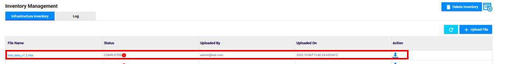

<link rel="stylesheet" href="../../../css/enlargeImage.css" />

# Import inventory data

First, make sure that you are working on the good scope :

{: .zoom}

## Generic template importation  

**If you want to know how to build the generic template, you can find more information on [this](../../managing/genericTemplate) page.**

### Access to the page

1. Click on "Administration" 
2. Click on "Data Management" 
3. Click on "Global Data" 

{: .zoom}

### Upload the file

Click on "Upload File" : 

{: .zoom}

1. Click on "Browse" to select the file that you want to upload
2. Check the box if you want to delete the current inventory data 
3. Click on "Submit"

{: .zoom}

After the file uploaded, it will be anlaysed. Once the analysis done, you will able to download the analysis report by clicking on the symbol circled in blue.

{: .zoom}

In the report you will see if there are some mistakes in your file and they will be highlighted if applicable. Otherwise you can submit the file.

Once the file is submited, you will see it in the table below : 

{: .zoom}

### Data processing

Once your file has appeared in the table, as shown above, it will be processed with NiFi (the NiFi flow is launched every 5 minutes) and separated in different files from the original file you have uploaded. In order to see the generated files, click on Data. For example, when you upload a file like the OFR Template (as you can see [here](../../managing/templateForApplications)), you will have all those files generated : 

{: .zoom}

In this table, you can see if the records have been processed and how much have been processed.

## Raw data importation 

**If you want to know how to build the raw data files, you can find more information on [this](../../managing/rawData) page.**

