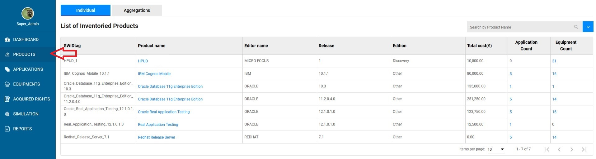
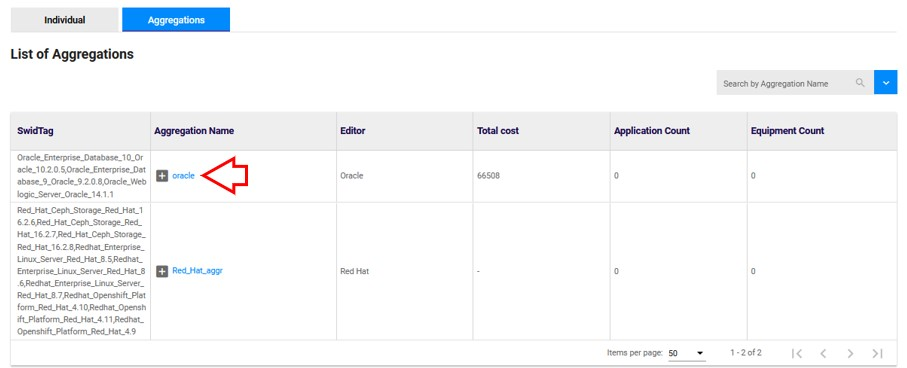
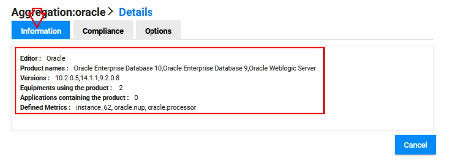

# Check aggregations informations 

## Access to the page 

Go to "Products" :

{: .zoom}

Click on aggregation :

{: .zoom}

## Select the aggregation

Click on the aggregation name : 

{: .zoom}

## Check the information

In the details of the product, click on "Information" :

{: .zoom}

You are now able to check :     
- The "Editor" : the Editor of the product        
- The "Product Names" : The names of the products of the aggregation    
- The "Versions" : The versions of the products    
- The "Applications containing the product" : The number of application which contains the product     
- The "Defined Metrics" : The names of metrics defined for the aggregation.    

<!--
**If no metric is defined, you will get a message as shown below.**

{: .zoom}-->

