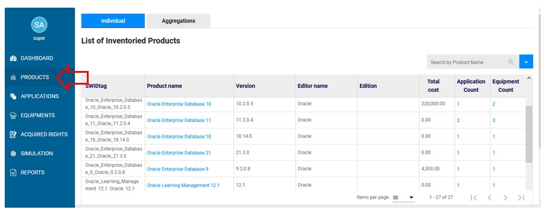
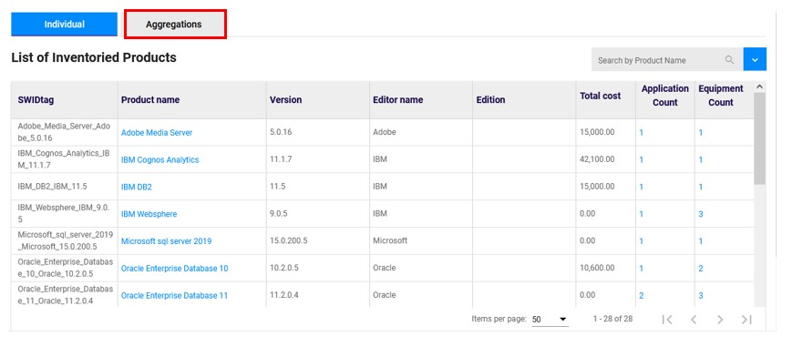
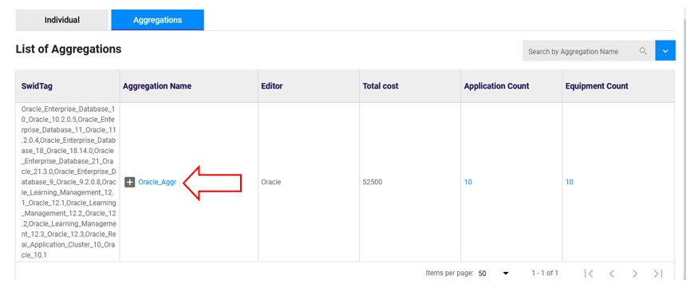
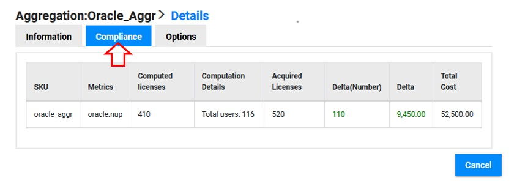

# Check compliance for an aggregation

## Access to the page 

Go to "Products" :

{: .zoom}

Click on aggregation :

{: .zoom}

## Select the aggregation

Click on the aggregation name : 

{: .zoom}

## Check the compliance

In the details of the aggregation, click on "Compliance" :

{: .zoom}

You are now able to check :  
- The "SKU" : Identifier of the rights you have acquired  
- The "metrics" : Identifier of the metric(s) used for this aggregation  
- The number of "Computed licenses" : Number of licenses required for your total product installations in the aggregation (computed by OpTISAM)  
- The number of "Acquired licenses" : Number of licenses acquired (information you provided to OpTISAM)  
- The "delta" in number of licenses or euros : Difference between "Acquired" and "Computed" licenses (positive = underusage / negative = counterfeiting)  
- The "total cost" : Total cost of your "Acquired licenses" (including the maintenance cost)  

**Notice during the computation of aggregation, individual rights are not considered. 
It takes into account the rights defined for the aggregation only.  
Then if 2 aggregations have the same name, only one computation result will be displayed for all sku having the same metric. But if the metric is not the same, and not NUP or processor, the computation will display one line for each metric**  

<!--
**Notice that it's impossible to check the compliance of a single product in the aggregation. The compliance is computed for all product in the aggregation as you can see above.
It takes into account the rights defined for the aggregation plus each individual right of each swidtag composing the aggregation.  
Then if 2 aggregations have the same name, only one computation result will be displayed for all sku having the same metric. But if the metric is not the same, and not NUP or processor, the computation will display one line for each metric**    
-->

