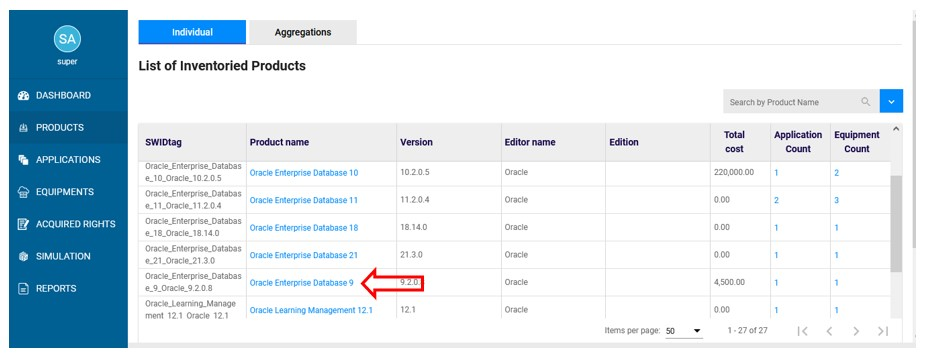
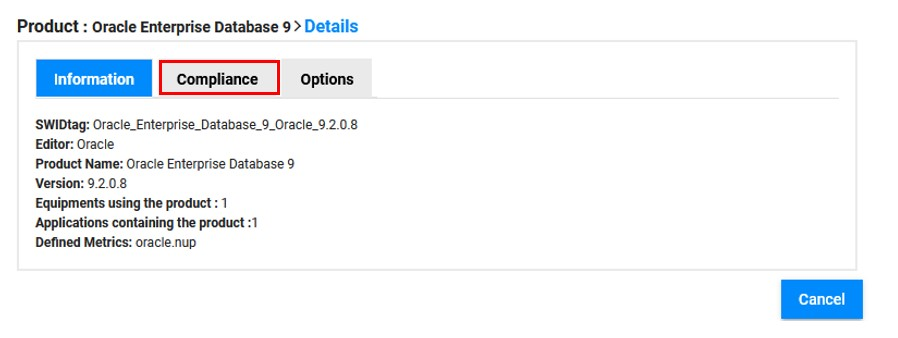
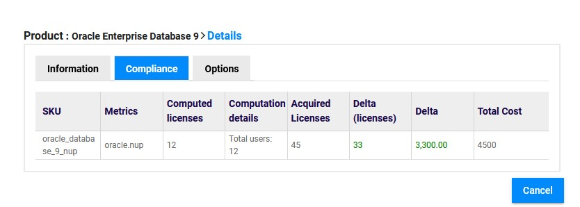
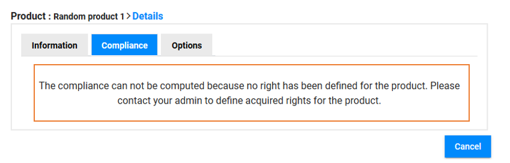

<link rel="stylesheet" href="../../../css/enlargeImage.css" />

# Check compliance for one product

## Acces to the page

Go to "products":

{: .zoom}

Click on the product that you want to check the compliance:

{: .zoom}

This page page will be shown:

Then you will have to click on "compliance"

{: .zoom}

"After clicking on compliance", this page will be shown:

{: .zoom}

You are now able to check :  

- The "SKU" : Identifier of the rights you have acquired  
- The "metrics" : Identifier of the metric(s) used for this product  
- The number of "Computed licenses" : Number of licenses required for your product installations (computed by OpTISAM)  
- The number of "Acquired licenses" : Number of licenses acquired (information you provided to OpTISAM)  
- The "delta" in number of licenses or euros : Difference between "Acquired" and "Computed" licenses (positive = underusage / negative = counterfeiting)  
- The "total cost" : Total cost of your "Acquired licenses" (including the maintenance cost)  

<!--To get all the details of the computation, please click on the plus (+) symbol in the metrics column. You will get them as shown bellow:

[select APM](../../img/exploring/computingDetails.jpg){: .zoom}
 
 -->
### **Others cases:**

If the product is not licensed, you will get a message as shown below:

{: .zoom}

Then if the product is in an aggregation, after clicking on compliance, you will get this page:

{: .zoom}

You will have to clik on the name of the aggregation, there "oracle" and you will see informations about the product in the aggregation as shown [there](../checkAggregationCompliance)

