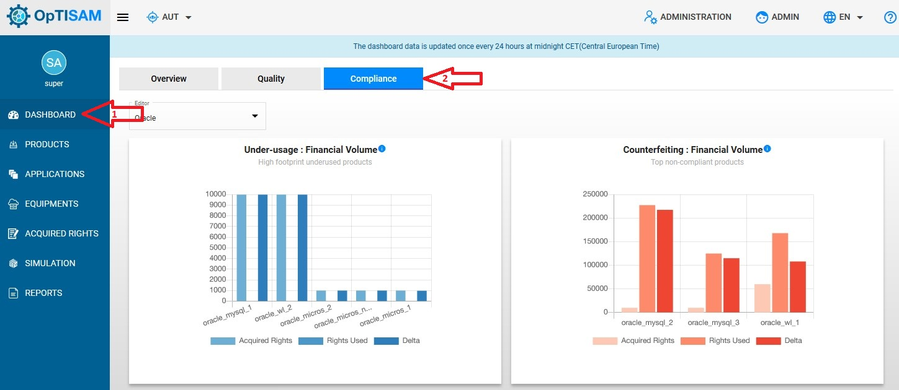
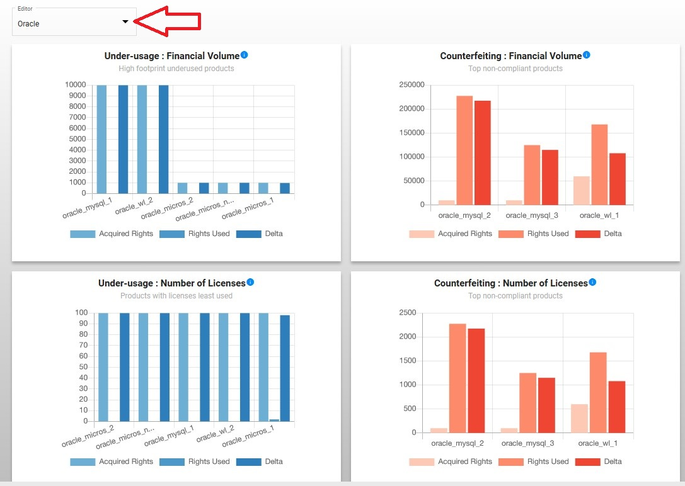
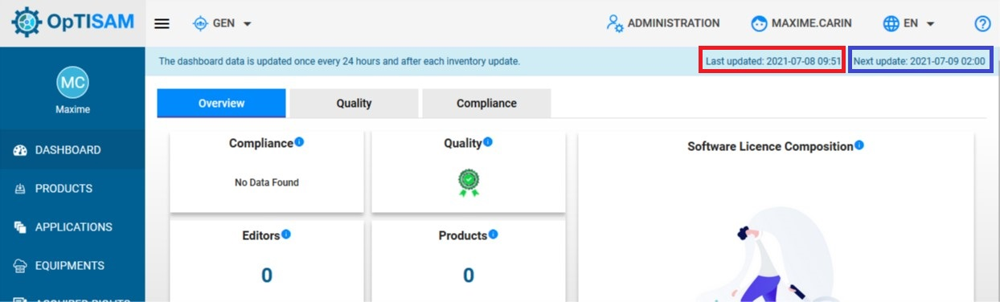

<link rel="stylesheet" href="../../../css/enlargeImage.css" />

# Check global compliance

## Access to the page

Go to "Dashboard", then click on "Compliance" :

{: .zoom}

## Choose the editor

Click on Editor and choose the Editor for which you want to see the compliance : 

{: .zoom}

## Checking the underusage and the counterfeiting

You are now able to check the underusage and the counterfeiting for all the products from an Editor, e.g : for Oracle :

{: .zoom}

You can mouse over the graphs to have the precise values.

### Underusage

As you can see on the Oracle screenshot for "Underusage", there are :  
- 125 : "Acquired Rights"  
- 0 : "Rights Used"  
- 125 : "Delta"  

This means that you currently have 125 acquired rights unused (not deployed on any equipment) so this is considered as "Underusage".

### Counterfeiting

As you can see on the Oracle screenshot for "Counterfeiting", there are (in euros) :  
- 123750€ : "Acquired Rights" (not visible because the difference between the values is too big)  
- 164 980 800€ : "Rights Used"  
- 164 857 050€ : "Delta"  

Or on the other graph, there are (in number of licenses) :  
- 275 : "Acquired Rights" (not visible because the difference between the values is too big)  
- 366 624 : "Rights Used"  
- 366 349 : "Delta"  

This means that you currently have 275 acquired rights for 366 624 rights used so you are counterfeiting a delta of 366 349 rights, this represents a 164 857 050€ delta. So you can be subject to a fine in the case of an audit.

## Dashboard update

The dashboard is computed after each inventory update and each day at 2:00.

{: .zoom}

As you can see, on the dashboard you can find :  
- The last update time of the dashboard  
- The next update time of the dashboard (if there is no data injection)

