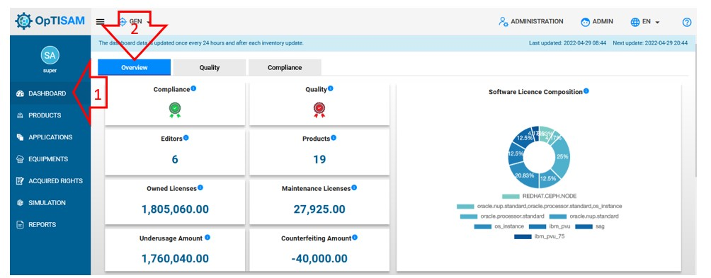

<link rel="stylesheet" href="../../../css/enlargeImage.css" />  

# Check global informations

## Access to the page

You have to click on "Dashboard" and "Overview" : 

{: .zoom}

You are now able to check:

The compliance statu:   Shows the state of compliance.
- Green : (under usage/total number of acquired licenses)=0 AND (Conterfeiting/total number of acquired lienceses)=0  
-  Orange : (conterfeiting/total number of acquired licenses) between 0 and 10% OR (under usage/total number of acquired licenses) between 10% and 25%     
-  Red :(conterfeiting/total number of acquired licenses) more than 10% AND (under usage/total number of acquired licenses) more than 25%   

The Quality : State of the default products (A product for which at least one license has been bought but it is not currently deployed or the product is deployed at least on one host but no license is registered for it).    

- Green : 0 products in default  
-  Orange : between 10% and 30% of products in default
-  Red : more than 30% of  products in default   

The "Editors" : The number of editors of differents products    
The "Products" : The number of products    
The "Owned Licenses" : The amount of licenses owned     
The "Maintenance Licenses" : The amount of licenses under maintenance   
The "Shared Licenses" : The number of licenses shared
The "Received Licenses" : The number of licenses received
The "Underusage Amount" : The amount of licenses underused  
The "Conterfeiting Amount" : The amount of licences overused
The "Scope Expense" : The amount of the expenses of the entity
The "Software License composition" : The percentage of metrics used  
The "Equipment Details" : The parts of equipment used   
The "Number of products Per Editor" : The percentage of product used by editors.    