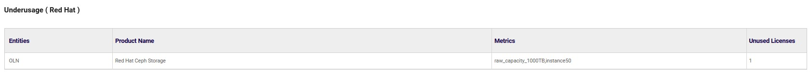

# Group compliance

## Access

Go to "GROUP COMPLIANCE" : 

{: .zoom}

This page will be displayed :

{: .zoom}

From there you will have to select a group and you will be able to see information about this group :

**Notice that only groups where the checkbox "Group compliance" is activated can be selected for the group compliance. You can access to group management [here](../../pages/managing/groupsManagement.md)** 

- ## Software Expenditure

Form there you can see the software expenditure of each entity : 

{: .zoom}

Notice that ***"Selected entities"*** are names of entities that are part of the group selected 

- ## Group Compliance

From there you have to select an editor and a product on which you want to check the compliance of the group. 

{: .zoom}

- ## Underusage

From there can check the underusage of the group about the products of the editor choosen 

{: .zoom}