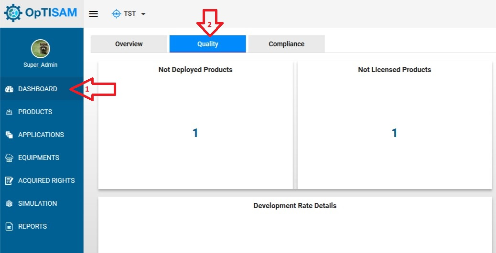
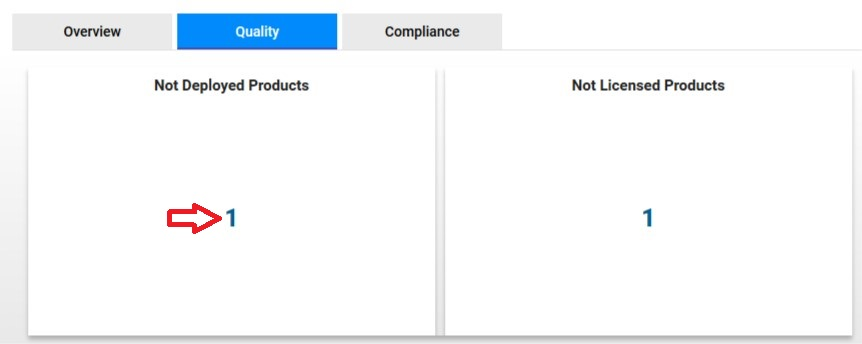
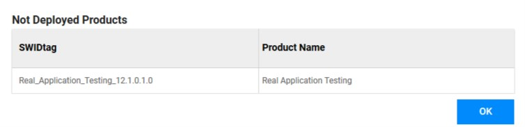
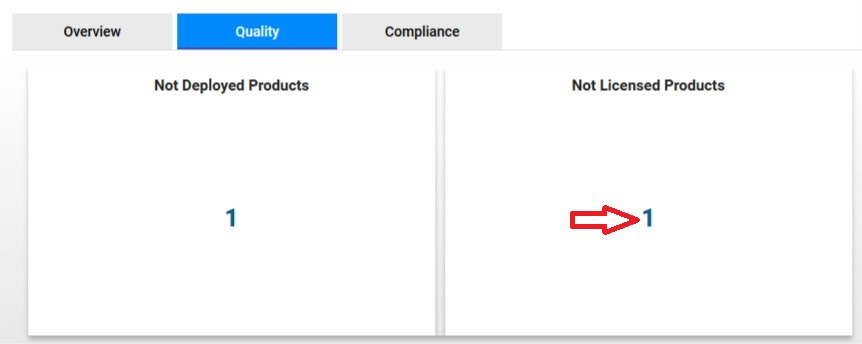
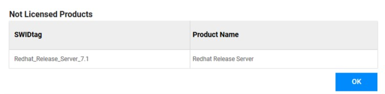

<link rel="stylesheet" href="../../../css/enlargeImage.css" />

# Check products deployment

## Access to the page

You have to click on "Dashboard" and "Quality" : 

{: .zoom}

## Check the products that are not deployed

In order to know, which products are not deployed in your inventory (and for which you provided acquired rights to OpTISAM), click on the number here :  

{: .zoom}

This screen will be shown : 

{: .zoom}

## Check the products that are not licensed

In order to know, which products are not licensed (and are deployed on some equipments), click on the number here :  

{: .zoom}

This screen will be shown : 

{: .zoom}

