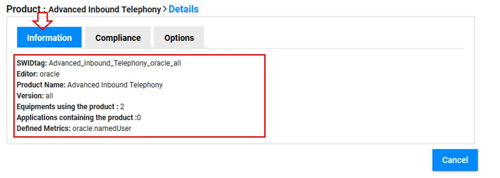

<link rel="stylesheet" href="../../../css/enlargeImage.css" />

# Check a product informations

## Access to the page

"Go to the product" :

{: .zoom}

## Select a product 

Click on the product name : 

{: .zoom}

## check the informations

In the details of the product, click on "Information" :

{: .zoom}

You are now able to check :  
- The "SWIDTAG" : SWIDtag of the product    
- The "Editor" : the Editor of the product        
- The "Product Name" : The name of the product    
- The "Version" : The version of the product  
- The "Equipments using the product" : The number of equipment which uses the product  
- The "Applications containing the product" : The number of application which contains the product     
- The "Defined the Metrics" : The names of metrics defined for compliance computing.   

**If no metric is defined, you will get a message as shown below.**

{: .zoom}

