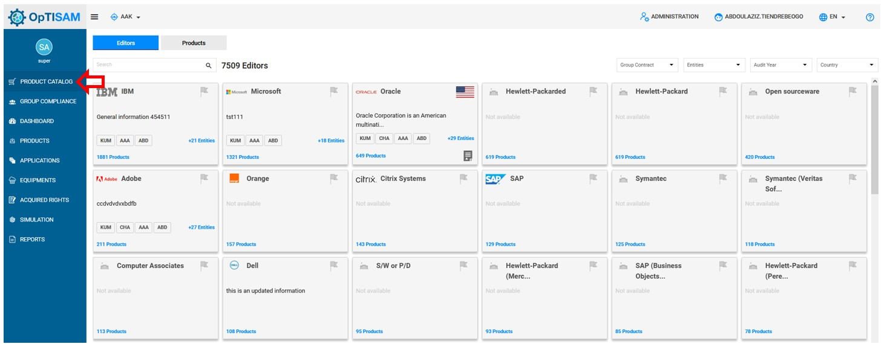
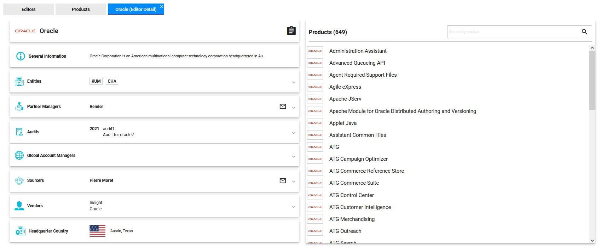
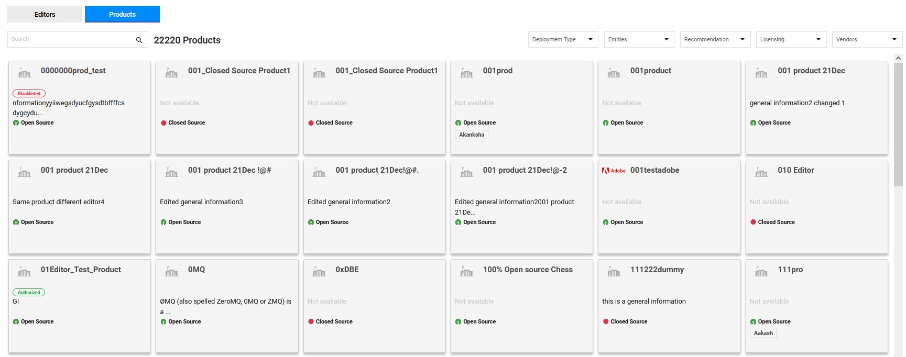
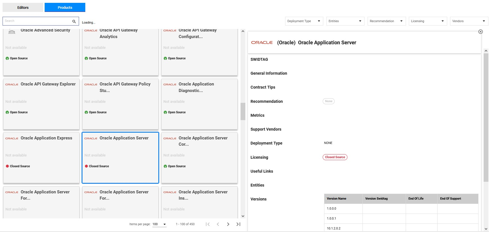

<link rel="stylesheet" href="../../../css/enlargeImage.css" />  

# Check product catalog

## Access to the page

You can access to the product catalog via the url of OpTISAM even if you don't have an account.

If you have an account, to access to the product catalog after loging,

You have to click on "Product catalog" then the page below will be displayed : 

{: .zoom}

## Editors

In the Editors section, you are able to see cards of all editors with some information about them as : generral information about the editor, the number of products and the number of entities that use products of these editors. 

To see more details about an editor, click on its name. The page below will be displayed:

Notice that you can search an editor by its name.

{: .zoom}

You are able to see : 

- General Information: The general information on the editor
- Entities : Entities that use the products of the editor
- Partner Manager: name and email of the referent within Orange
- Audits: The date of different audits
- Global Account Managers
- Sourcers :  name and email of sourcers 
- Vendors: List of differents vendors
- Headquarter Country

You can also see a list of all the prodcuts of the editor. 

## Products

When you click on "Products", you are able to see this page:
 

{: .zoom}

In this section, you are able to see cards of all the products of the catalog with some information about them as : general information, recommendation, and the licensing.

To see more details about a product, click on its name. The page below will be displayed:

Notice that you can search a product by its name.

{: .zoom}

On the right side you can see the information about the product : 

- The product and editor name 

- Swidtag: The unique identifier of the product   

- General information: The general information on the product 

- Contract tips: Some tips about the contract

- Recommendation: The different recommandations 

- Metrics: The different metrics used

-  Support vendors: The different vendors 

- Deployment Type: 

- Licensing: The Type of licensing of the product 

- Useful links: Some useful links about the product  

- Entities: List of differents entities working using the product 

- Versions: The different versions of the product 

<!--
## Use case

Notice that one the product catalog upload, you can use it. 

- In aggregation : You can create an aggregation with products from the product catalog

- In aquired right : You can choose the editors/products present in the product catalog when creating or updating an acquired right -->

