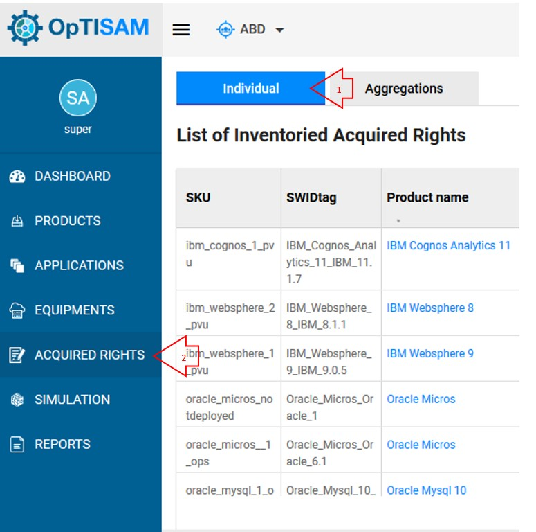
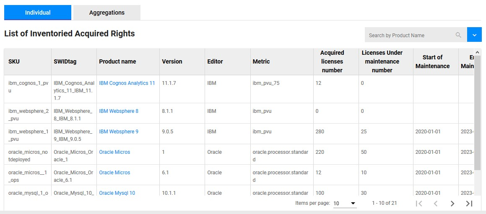

<link rel="stylesheet" href="../../../../css/enlargeImage.css" />

# Acquired rights

This page displays all the rights you acquired for all of your products (only the rights that you injected).

## Access to the page

Click on "Acquired Rights" and on "Individual" : 

{: .zoom}

## Description

You are now able to see the list of all of your acquired rights :

{: .zoom}

There are a lot of attributes so you can't see them all on the screenshot, among them :  
- SKU : The identifier of your acquired right  
- SWIDtag : The identifier of the product. **The format is: ProductName_EditorName_Version.** 
- Product name : The name of the product (You can click on it to have more information about it)  
- Version / Editor : The version and the editor of the product  
- Metric : Name of the metric used for the acquired right  
- Acquired licenses number : The number of licences acquired  
- Licenses under maintenance number : The number of licenses under maintenance acquired  
- Start / End of the maintenance : Dates of start and end of the maintenance  
- Licenses under maintenance : Is your license under maintenance  
- AVG License / Maintenance unit price : Average price for each unit of license or maintenance acquired  
- Total purchase / maintenance cost : The total cost of your license / maintenance acquired  
- Total cost : The total cost (license + maintenance) for the product and for this sku  

