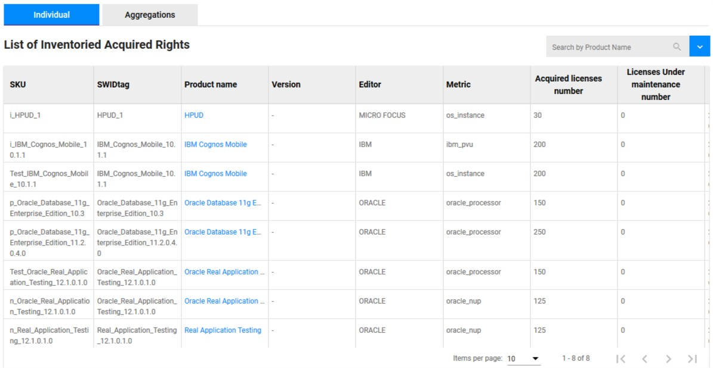

<link rel="stylesheet" href="../../../../css/enlargeImage.css" />

# Acquired rights

This page displays all the rights you acquired for all of your products (only the rights that you injected).

## Access to the page

Click on "Acquired Rights" and on "Individual" : 

{: .zoom}

## Description

You are now able to see the list of all of your acquired rights :

{: .zoom}

There are a lot of attributes so you can't see them all on the screenshot, among them :  

- SKU : The identifier of your acquired right  
- CSC : The name of the Corporate Sourcing the Contract
- Ordering Date : The date you order the license
- Product name : The name of the product (You can click on it to have more information about it)  
- Version / Editor : The version and the editor of the product  
- Sotware provider : The company that provide le license
- Metric : Name of the metric used for the acquired right  
- Acquired licenses number : The number of licences acquired  
- Available Licenses : The number of licenses available that can be shared
- Shared Licenses : The number of licenses shared with other entites    
- Received Licenses : The number of licenses received from another entity   
- Licenses under maintenance : The number of licenses under maintenance acquired  
- AVG Licenses Unit price : verage price for each unit of license 
- Total purchase cost : The total cost of your license   
- Total cost : The total cost (license + maintenance) for the product and for this sku  
- Last purchased order : The date of the last purchase
- Comment : Comment if necessary

