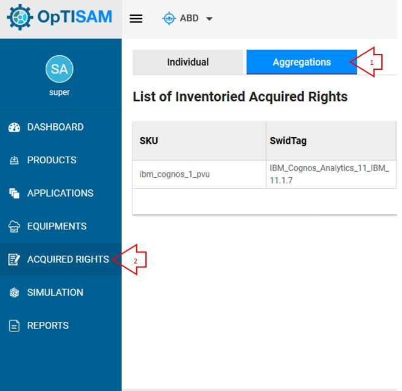
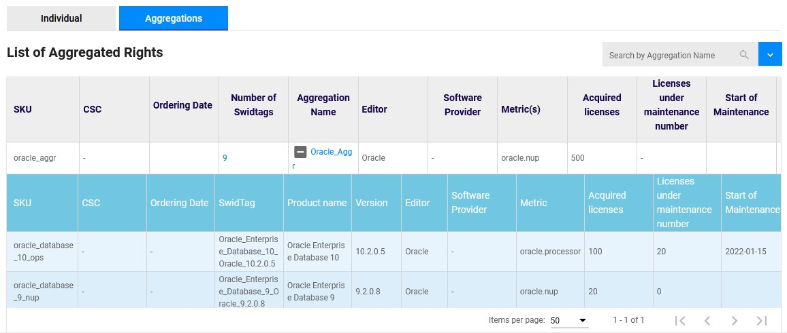

<link rel="stylesheet" href="../../../../css/enlargeImage.css" />

# Aggregations

An aggregation is something that you can create in order to regroup some products (e.g : by editor or metric).

## Access to the page

Click on "Acquired Rights" and on "Aggregations" : 

{: .zoom}

## Description

You are now able to see the list of all of your acquired rights by aggregations :

{: .zoom}

You have two tables in one, the first one is for your aggregations, the attributes are :  
- SKU : The identifier of your acquired right  
- CSC :  The name of the Corporate Sourcing the Contract
- Ordering Date : Date the ordedring
- Number of swidtags : The number of swidtags in the aggregation
- Aggregation name : The name of the aggregation  
- Editor : The editor of the products in the aggregation  
- Software provider : The name of the software provider
- Metrics : Name of the metric used for the acquired rights of the aggregation
- Acquired licenses : Total Number of acquired licenses
- Licenses under maintenance number : Number of licenses under mantenance
- Start /End of maintenance : Date of the start /end of the maintenance
- License under maintenance : state of the license. Yes if it is under maintenance and no if not.
- Unit price : price of a license 
- Maintence price : Price of the maintenance 
- Total purchase cost : The total cost of the purchase
- Total maintenance cost : The total cost of maintenance
- Total cost : The total cost (license + maintenance) for all the products included in the aggregation   
- Last purchased order : Date of the last purchase
- Support number : Number of support
- Mantenance provider : Name of maintenance porvider
- Comment : Comment if necessary 

The second one is giving the details of the rights for each product present in the aggregations :  
- SKU : The identifier of your acquired right  
- CSC : The name of the Corporate Sourcing the Contract
- Ordering Date : Date the ordedring
- SWIDtag : The identifier of the product  
- Product name : The name of the product (You can click on it to have more information about it)  
- Version / Editor : The version and the editor of the product  
- Editor : The name of the editor
- Software provider : The name of the software provider
- Metric : Name of the metric used for the acquired right  
- Acquired licenses : The number of licences acquired  
- Licenses under maintenance number : The number of licenses under maintenance acquired  
- Start / End of the maintenance : Dates of start and end of the maintenance  
- Licenses under maintenance : Is your license under maintenance  
- AVG License / Maintenance unit price : Price for each unit of license or maintenance acquired  
- Maintence price : Price of the maintenance 
- Total purchase / maintenance cost : The total cost of your license / maintenance acquired  
- Total cost : The total cost (license + maintenance) for the product   
- Last purchased order : 
- Support number : Number of support
- Mantenance provider : Name of maintenance porvider
- Comment : Comment if necessary 

## How to create an aggregation

If you're an admin and you want to know how to create an aggregation, just click [here](../../../managing/aggregationsManagement).

