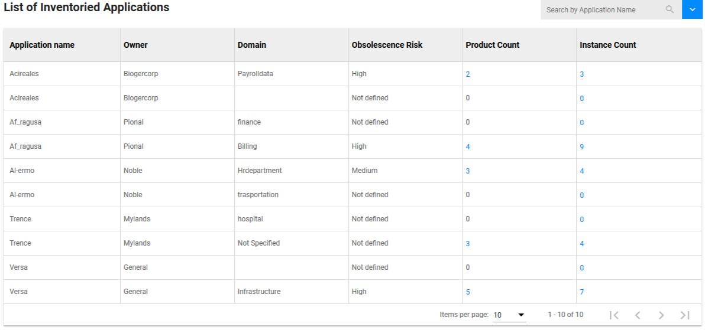

<link rel="stylesheet" href="../../../../css/enlargeImage.css" />

# Applications

## Presentation 

This is a list of all the applications that you have installed on your equipments, e.g : 

{: .zoom}

You can see all of the attributes :  
- Application name : Gives you the name of the application  
- Owner : Gives you the name of the application's editor  
- Domain : Gives you the domain of the application  
- Obsolescence Risk : Gives you the risk of obsolescence for the application if it is defined  
- Product count and Instance count : Gives you the number of products or instances related to this application, you can click it to have a list  

## Further details

For further details, you can check [here](../../../managing/genericTemplate) the documentation about "Data management".

