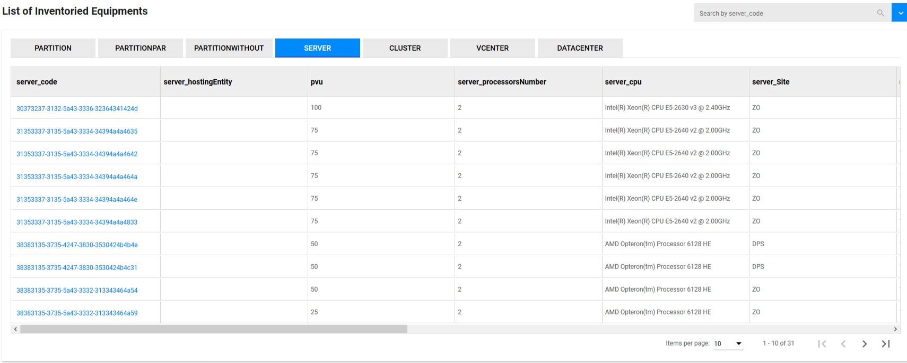

<link rel="stylesheet" href="../../../../css/enlargeImage.css" />

# Equipments

## Different types 

Every IT park has its own structure, therefore OpTISAM allows you to customize the organization of your equipments by defining equipment types (see "Configure OpTISAM" section [here](../../../configure/createEquipmentTypes)).  

Below is an example of an IT park composed of 4 equipment types :  

- SoftPartition   
- Server  
- Cluster  
- VCenter   
   

{: .zoom}

## Attributes

Each of this equipment type have a list of attributes that you can personalize as you wish.  
In the previous example, some attributes of "Server" are :  
- server ID
- IBM PVU 
- Sever Name
- Core Per Processor
- Oracle Core Factor
- Hyperthreading
- Sever type

## Relations

One equipment type can have only one other equipement type as parent.  
Several equipment types can have the same equipement type as parent.  

For example :  
- "Server" is the parent of "SoftPartition"  
- "Cluster" is the parent of "Server"  
- "VCenter" is the parent of "Cluster"   

## Further details

For further details, you can check [here](../../../managing/equipmentsManagement) the documentation about "Equipments management".

