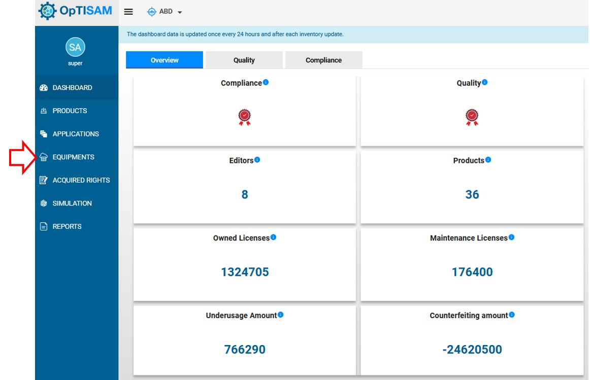
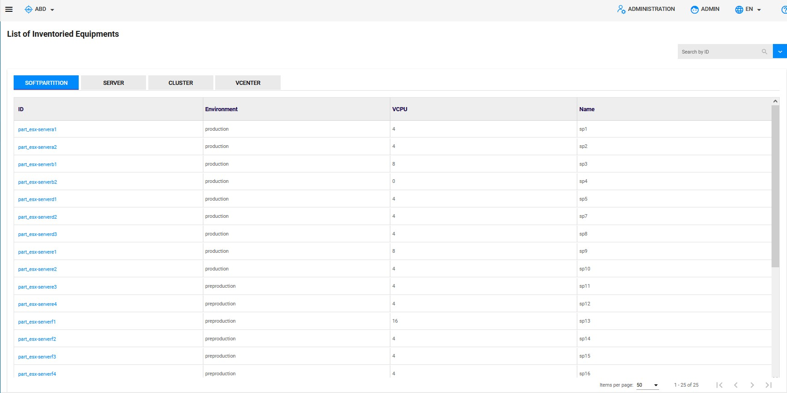
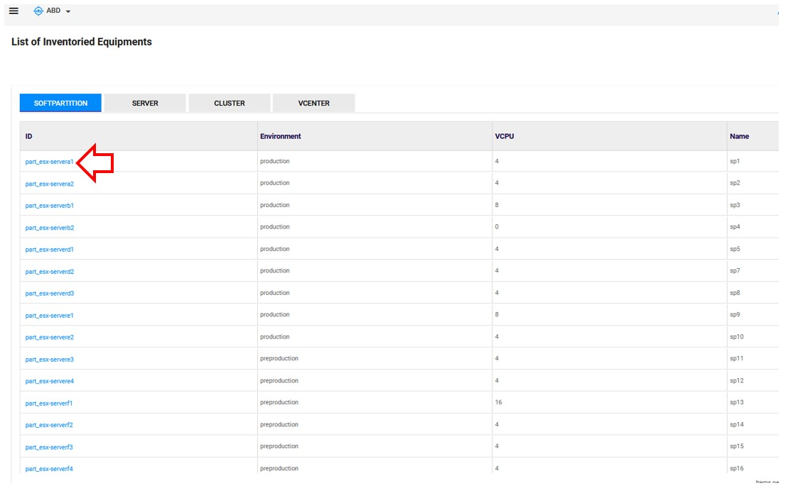
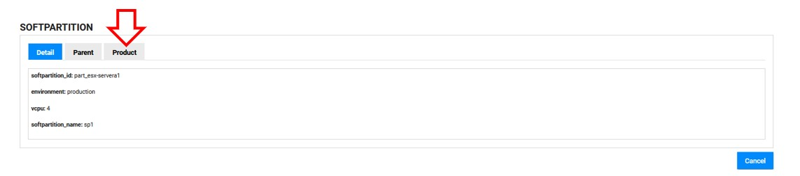
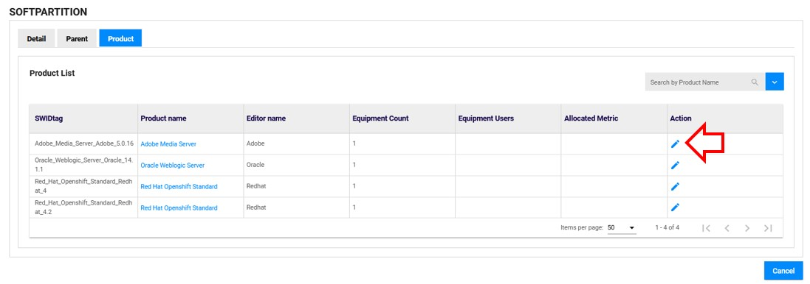
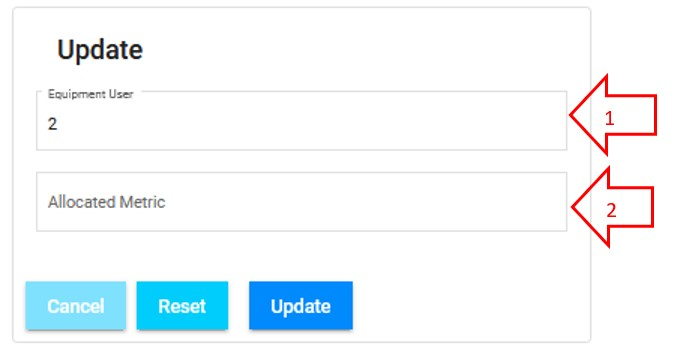

<link rel="stylesheet" href="../../../../css/enlargeImage.css" />

# Products

In the products menu you will see all the products that you have installed or not on your equipments.  
You can see your products :  
- One by one ([individually](#individually))  
- By group ([aggregation of products](#aggregations))  

The list of products is ordered alphabetically.

## Individually

{: .zoom}

You can see all of the attributes :  
- SWIDtag : The identifier of the product.   
**SWIDtag is generate from the product name, its version and its editor name. The format is "prdoductName_editorName_version"**      
- Product name : The name of the product.  
- Editor name : The name of the product's editor     
**"_" is not allowed in product name and version neither in the editor name**   
- Release : The version of the product  
- Edition : The edition of the product  
- Total cost (€) : The total cost of the product with all the licences and maintenance costs  
- Application count and Equipment count : The number of applications and equipments related to the product, you can click it to have a list

## Aggregations

An aggregation is a group of product. Aggregations are created by the administrator (see [here](../../../managing/aggregationsManagement)).  

{: .zoom}

You can find the same attributes but the counts and the cost will represent the total number corresponding to all the products in the aggregations.

## Further details

For further details, you can check [here](../../../managing/genericTemplate) the documentation about "Data management".  
For further details, you can check [here](../../../managing/aggregationsManagement) the documentation about "Aggregations management".

### ***Allocate a metric to an equipment***

It's possible to allocate a metric to a product and an equipment. 

Notice that the metric is applied to all parent equipments till the upper equipment in the hierarchy given as last equipment of the metric and if the equipment is part of a vcenter, all equipments under the same vcenter will have the metric for the same product, and when the metric is modified, it impacts all the equipments under the vcenter. 

Only metrics with types oracle.nup.standard and oracle.processor.standard can be allocated. 

To allocate a metric to a product and an equipment, go first to equipment.

{: .zoom}

This page will be shown:

{: .zoom}

You will have now to chose on which equipment you desire to allocate the metric by its ID and click on it.

{: .zoom}

Then go to product:

{: .zoom}

Once on product page, you will have to chose the product on which do the allocation by clicking on the pencil icone. 

{: .zoom}

This page will be shown:

{: .zoom}

You will have to fill the two fields.

1. Equipment user: The number of user of the equipment
2. Allocated metric: The name of metric (oracle.nup.standard or oracle.processor.standard)

Once the two fields fill, click on update. Now a metric is allocated to a specific product and equipment. 

