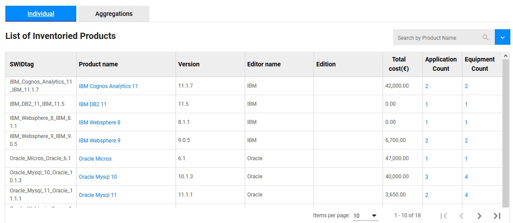
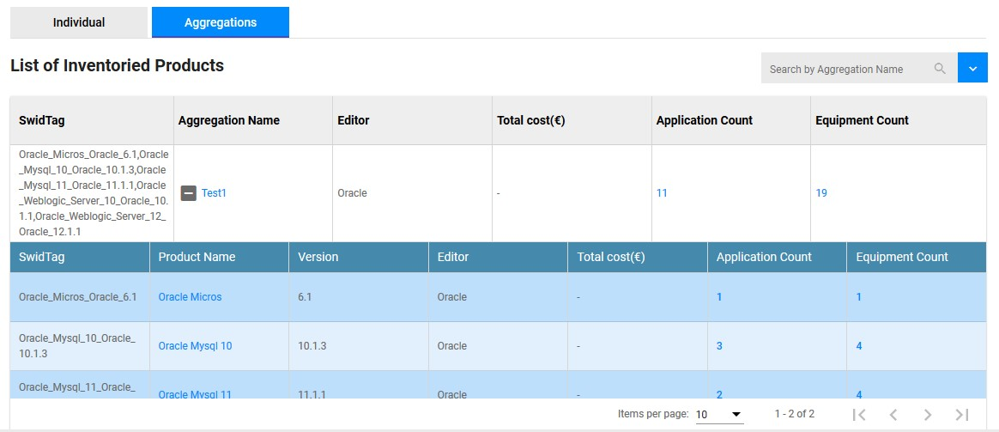

<link rel="stylesheet" href="../../../../css/enlargeImage.css" />

# Products

In the products menu you will see all the products that you have installed or not on your equipments.  
You can see your products :  
- One by one ([individually](#individually))  
- By group ([aggregation of products](#aggregations))  

The list of products is ordered alphabetically.

## Individually

{: .zoom}

You can see all of the attributes :  
- SWIDtag : The identifier of the product.   
**SWIDtag is generate from the product name, its version and its editor name. The format is "prdoductName_editorName_version"**      
- Product name : The name of the product.  
- Editor name : The name of the product's editor     
**"_" is not allowed in product name and version neither in the editor name**   
- Release : The version of the product  
- Edition : The edition of the product  
- Total cost (€) : The total cost of the product with all the licences and maintenance costs  
- Application count and Equipment count : The number of applications and equipments related to the product, you can click it to have a list

## Aggregations

An aggregation is a group of product. Aggregations are created by the administrator (see [here](../../../managing/aggregationsManagement)).  

{: .zoom}

You can find the same attributes but the counts and the cost will represent the total number corresponding to all the products in the aggregations.

## Further details

For further details, you can check [here](../../../managing/genericTemplate) the documentation about "Data management".  
For further details, you can check [here](../../../managing/aggregationsManagement) the documentation about "Aggregations management".

