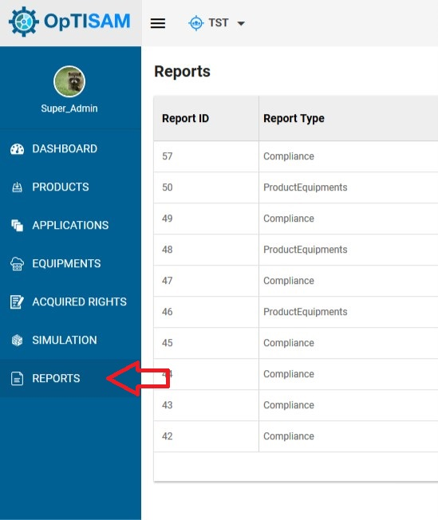
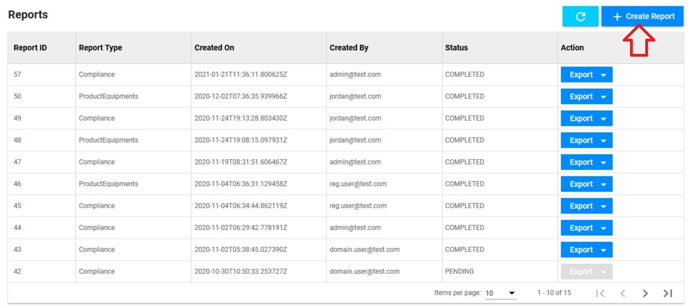
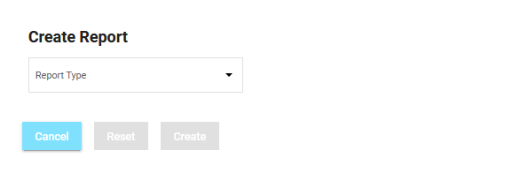
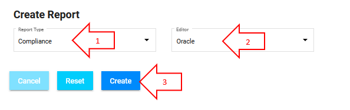

<link rel="stylesheet" href="../../../../css/enlargeImage.css" />

# Reports - Compliance

**This reports section allows you to create reports in CSV or PDF for the compliance of your products.**

## Access to the page

Click on "Reports" : 

{: .zoom}

## Create the report : 

Click on "Create Report" : 

{: .zoom}

This page will be shown:   

{: .zoom}

You will have to chose the report type. It can be about compliance or product equipments.

To create a report about compliance, you will have to follow the steps below:

{: .zoom}

1- Chose "compliance" as report type       
2- Chose the editor on which you want to create the report  
3- Click on "Create" to create your report. 

## Results of the report

You can find the report you've just created in the list.  
To see the results of a report, click on "Export" and select "PDF" or "CSV". This will generate a file that you can download.

{: .zoom}

### CSV

In the CSV report you will find a table with all the attributes to know if your product is compliant : 

{: .zoom}

The attributes are :  
- SKU : Identifier of the rights you have acquired  
- Aggregation Name : The name of the aggrefation if applicable
- SWIDTag : Identifier of the product  
- Editor : Editor of the product  
- Metric : Identifier of the metric used for this product  
- ComputedLicenses : Number of licenses needed for your deployment  
- Computation Details : Details of the computation if many metrics are used
- AcquiredLicenses : Number of licenses acquired  
- Delta (licenses) : Difference between "Acquired" and "Computed" licenses (positive = underusage, negative = counterfeiting)  
- Delta (cost) : Difference between "Acquired" and "Computed" licenses in euros (positive = underusage, negative = counterfeiting)  
- TotalCost : Total cost of your "Acquired licenses"  
- AvgUnitPrice : The unit price of a license  

### PDF

In the PDF report you will find a table with all the attributes to know if your product is compliant : 

{: .zoom}

The attributes are the same as in the CSV file.

