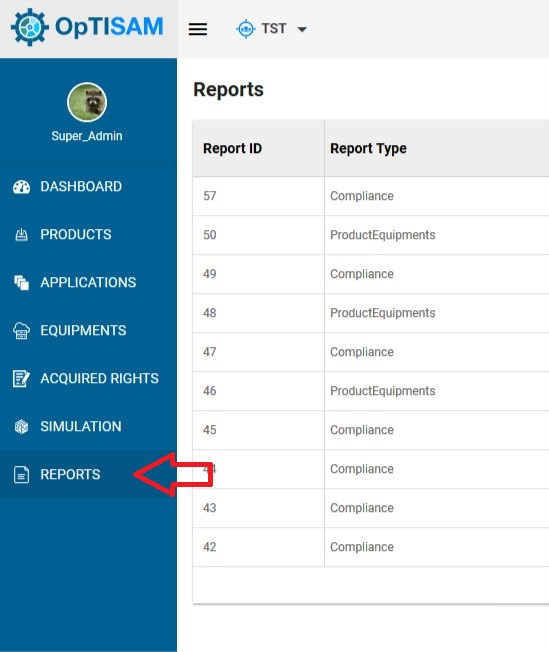
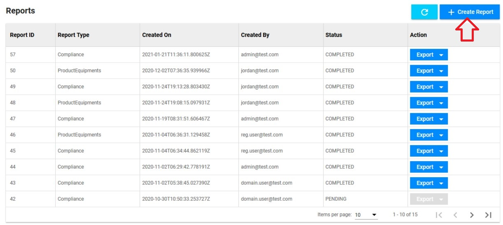
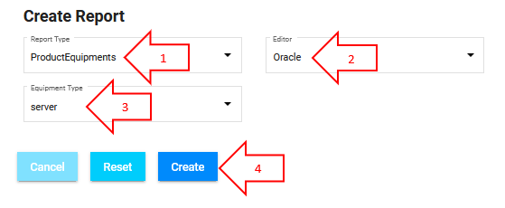
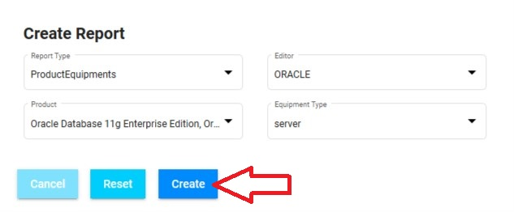
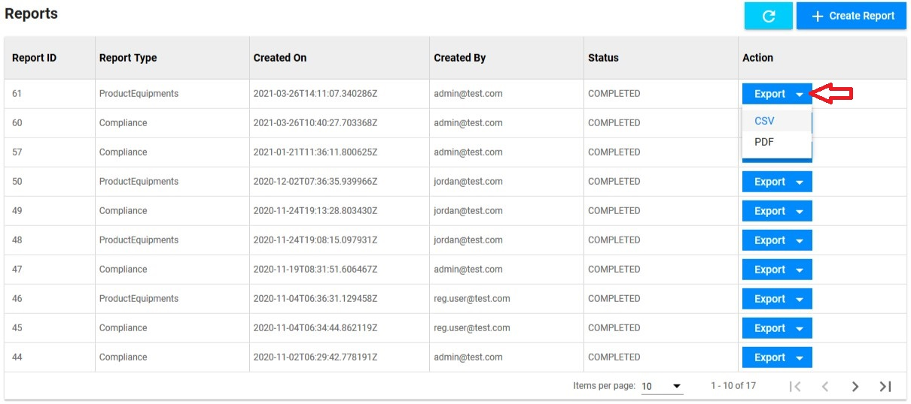
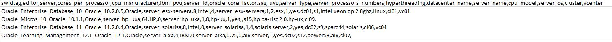
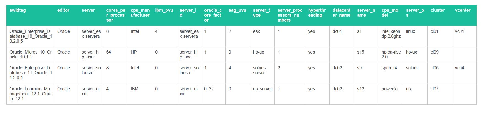

<link rel="stylesheet" href="../../../../css/enlargeImage.css" />

# Reports - Inventory

**This reports section allows you to create reports in CSV or PDF for the list of equipments on which a product (or more) is (are) installed.**

## Access to the page

Click on "Reports" : 

{: .zoom}

## Create the report : 

Click on "Create Report" : 

{: .zoom}

This page will be shown:   

{: .zoom}

To create a report about product equipments, you will have to follow the steps below:

{: .zoom}

1- Chose "ProductEquipment" as report type,     
2- Chose the editor on which you want to create the report  
3- Chose the equipment type on which you want to create the report  
4- Click on "Create" to create your report
<!--
Select :  
- Report Type : Select "ProductEquipment"  
- Editor : The editor on which you want to create the report  
- Product : The product(s) on which you want to create the report  
- Equipment type : The type of equipment on which you want to create the report  

{: .zoom}

Click on "Create" to create your report.
-->
## Results of the report

You can find the report you've just created in the list.  
To see the results of a report, click on "Export" and select "PDF" or "CSV". This will generate a file that you can download.

{: .zoom}

### CSV

In the CSV report you will find a table with all the equipments (corresponding to the equipment type you have chosen) on which the product(s) that you have chosen is (are) installed : 

{: .zoom}

The attributes are :  
- SWIDTag : Identifier of the product  
- Editor : Editor of the product  
- Server : Identifier of the server  
- cores_per_processor/ cpu_manufacturer/ ibm_pvu/ server_id/ oracle_core_factor/ ag_uvu,server_type/ server_processors_numbers/ hyperthreading/ datacenter_name/ server_name/ cpu_model/ server_os : Attributes of the server 
<!--PVU / server_code / processorsNumber / cpu / Site / coresNumber / manufacturer / corefactor_oracle / model / sag / hostname : Attributes of the server  -->
- cluster / vcenter / datacenter : Identifiers of the parents of the equipment on which the product is installed  

### PDF

In the PDF report you will find a table with all the equipments (corresponding to the equipment type you have chosen) on which the product(s) that you have chosen is (are) installed.

{: .zoom}

The attributes are the same as in the CSV file.

