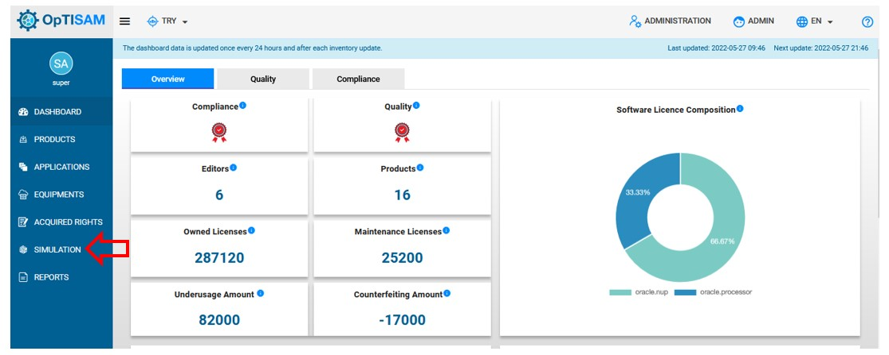
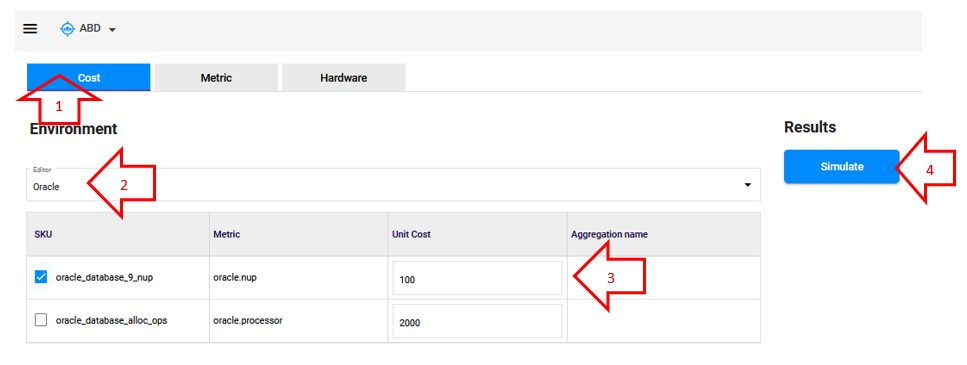

# Cost simulation

The cost simulation enables you to see the impact of the unit cost change on the compliance  or the financial aspect for a specfiic editor according your acquired rights. 

# Acces to the page 

Click on "Simulation" :

{: .zoom}

You will able to see this page :

{: .zoom}

# Create a cost simulation

To create a cost simulation, follow these steps : 

<!-- Image à ajouter-->
{: .zoom}

1. Go to cost
2. Choose the editor on which do the simulation
3. Check the box of the acquired right on which do the simulation, and edit the unit cost
4. Click on simulation to realise the simulation. 

# Check the results

Once you have clicked on "Simulate", The results will be displayed on the right

<!-- Image à ajouter--
{: .zoom}

The results are displayed by sku witch 3 attributes:

- Total computed cost before simulation : The last cost
- Total computed cost after simulation : The new cost
- Delta : Difference between the last cost and the new one.

Notice that the color of the frame of each sku depends of the "Delta":

- Red : The new total cost is greater than the last one, so "Delta" > 0 

- Green : The new total cost is lesser than the last one, so "Delta" < 0 

You can also check the differents total costs by editor before and after the simulation on the top on the results.