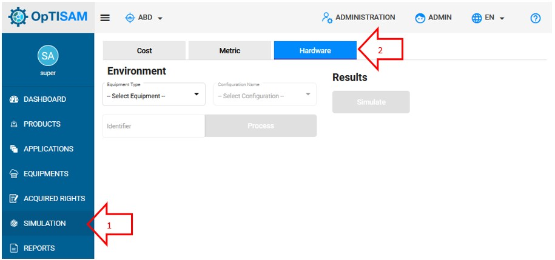
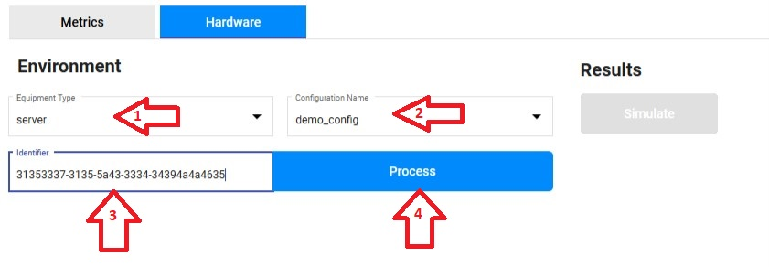
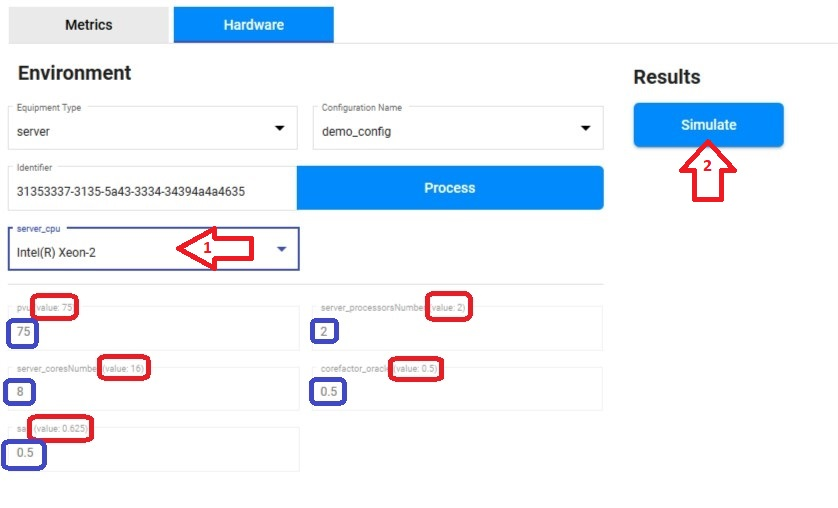
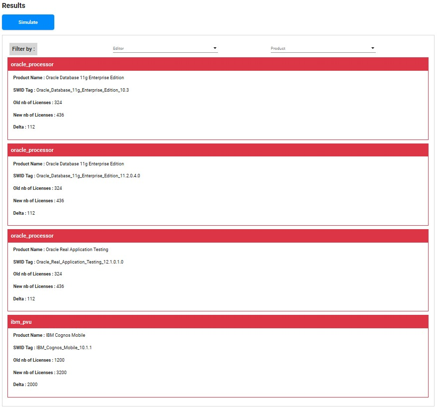

<link rel="stylesheet" href="../../../../css/enlargeImage.css" />

# Simulation - Hardware

The hardware simulation enables you to see the impact of a hardware change on the compliance or on the financial aspect.

## Access to the page

Click on "Simulation" and "Hardware" : 

{: .zoom}

## Create the configuration file

Click [here](../../../managing/simulationsManagement) to learn how to create a configuration file if you don't have one already.

## Create the simulation

{: .zoom}

1. Select the equipment type that is modified in your configuration file
2. Select the configuration file
3. Copy the identifier of the equipment for which you want to simulate a change (number of cpus, ...)  
4. Click on "Process"

On the screenshot, you can see that "server" is the selected equipment type, and that the identifier is the one of the server on which the simulation will be done.

Once you click on "Process", some other fields appears :

{: .zoom}

1. You have to select the server_cpu value that you want to do a simulation with
2. Click on Simulate to see how the modified values will modify the cost of all the licenses

Once you have a "server_cpu" value selected, you can see :  
- The real values of the selected server  
- The values of the "server_cpu" selected for the simulation (e.g : Intel Xeon-2)  

Once you click on "Simulate", the simulations appear : 

{: .zoom}

You can see a simulation for each acquired right (with each metric) that will be modified if you change the value as you simulated.  
You can filter the simulations either by "Editor" or by "Product".  
If the borders are in red (like on the screenshot), it means that the values selected for the simulation would cost you more money than the current values.  

As you can see, there are some values displayed for each simulation :  
- Metric name (e.g : oracle_processor) : Displayed as the "header" of each simulation, this is the metric used for the computing of the license with the values of the simulation
- Product name : The name of the product of the simulation  
- SWID Tag : The SWID Tag of the product of the simulation  
- old nb of Licenses : The current number of licenses  
- New nb of Licenses : The number of licenses needed with the simulation's value  
- Delta : The difference (in licenses number) between the current number of licenses and the number of licenses needed with the simulation's value  

## Further details

For further details, you can check [here](../../../managing/simulationsManagement) the documentation about "Simulations management".

