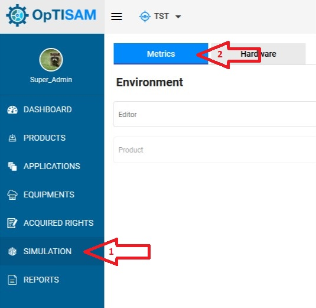
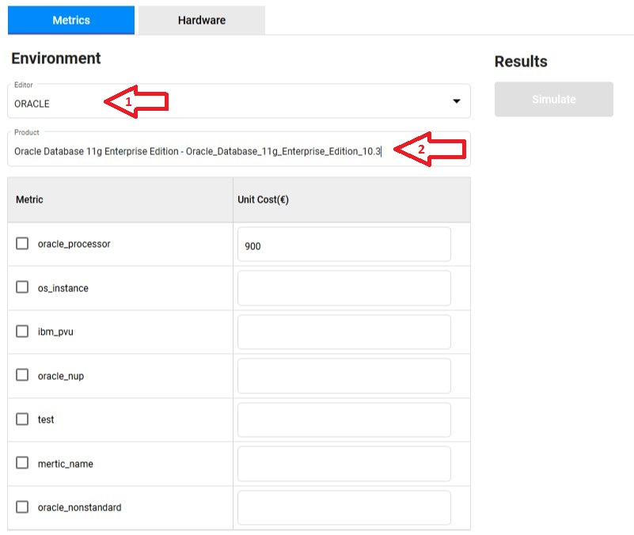
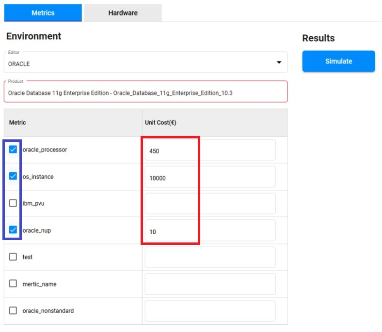
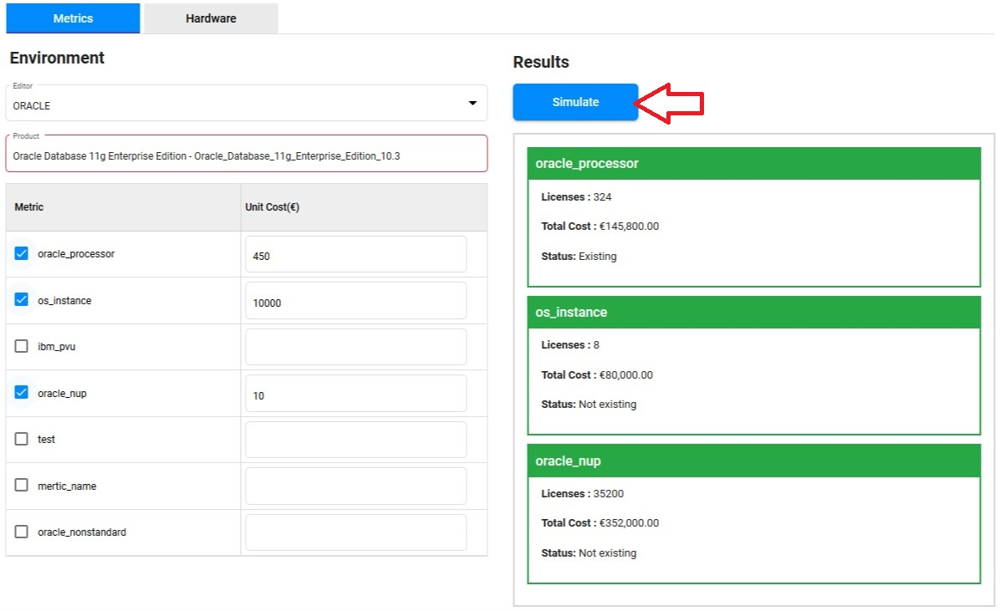

<link rel="stylesheet" href="../../../../css/enlargeImage.css" />

# Simulation - Metrics

The metrics simulation enables you to see the impact of a metric change on the compliance or on the financial aspect.

## Access to the page

Click on "Simulation" and click on "Metrics" :

{: .zoom}

## Create the simulation

### Select the product

Select the editor and the SWIDtag of the product on which you want to create the simulation : 

{: .zoom}

It will automatically write the metric and the cost that this product is using in the acquired rights.  

### Select the metric

Check the metrics and write the unit cost that you want to use to create the simulation : 

{: .zoom}

## Check the results

Once you have selected all the metrics that you want to simulate, just click on "Simulate".  

{: .zoom}

The results are displayed on the left by metric with 3 attributes :  
- Licenses : Number of licenses to acquire for the metric  
- Total cost : The total cost of the licenses  
- Status : "Existing" or "Not existing" depending if the metric is used or not  

## Further details

For further details, you can check [here](../../../managing/simulationsManagement) the documentation about "Simulations management".

