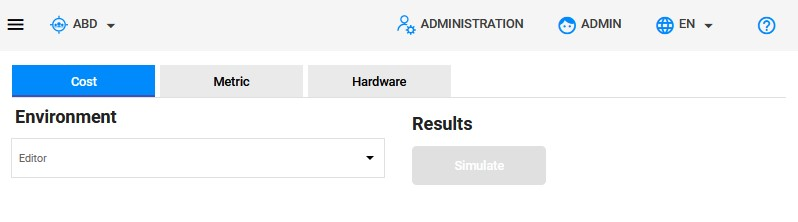
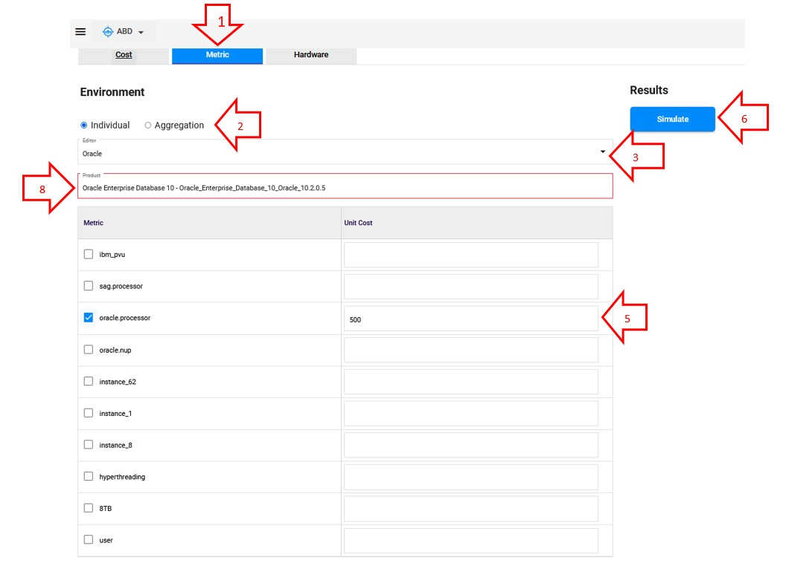
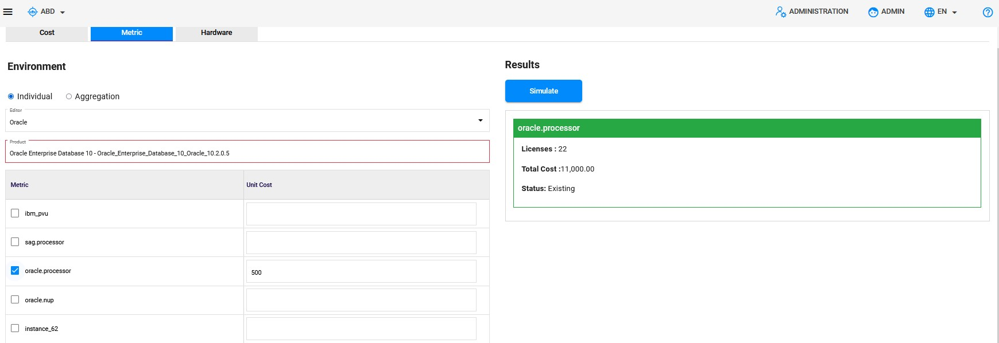

<link rel="stylesheet" href="../../../../css/enlargeImage.css" />

# Simulation <!-- (-Metrics) -->

The metrics simulation enables you to see the impact of a metric change on the compliance or on the financial aspect.

## Access to the page

Click on "Simulation" :

{: .zoom}

You will able to see this page 

{: .zoom}

## Create the simulation

To create the simulation, follow these steps:

{: .zoom}

1. Select the editor of the product on which you want to create the simulation
2. Chose the products on which you want to create the simulation
3. Edit the unit cost which will be used to simulate the new total cost
4. Click on "simulate" to create the simulation

<!--
Select the editor and the SWIDtag of the product on which you want to create the simulation : 

{: .zoom}

It will automatically write the metric and the cost that this product is using in the acquired rights.  

### Select the metric

Check the metrics and write the unit cost that you want to use to create the simulation : 

{: .zoom}
-->
## Check the results

Once you have clicked on "Simulate", The results will be displayed on the right

{: .zoom}

The results are displayed by sku witch 3 attributes:

- Total computed cost before simulation : The last cost 
- Total computed cost after simulation : The new cost
- Delta : Difference between the last cost and the new one. 

Notice that the color of the frame of each sku depends of the "Delta":

- Red : The new total cost is greater than the last one, so "Delta" > 0 

- Green : The new total cost is lesser than the last one, so "Delta" < 0 

**You can also check the differents total costs by editor before and after the simulation on the top on the results.** 

<!--
{: .zoom}

The results are displayed on the left by metric with 3 attributes :  
- Licenses : Number of licenses to acquire for the metric  
- Total cost : The total cost of the licenses  
- Status : "Existing" or "Not existing" depending if the metric is used or not  
-->
## Further details

For further details, you can check [here](../../../managing/simulationsManagement) the documentation about "Simulations management".

