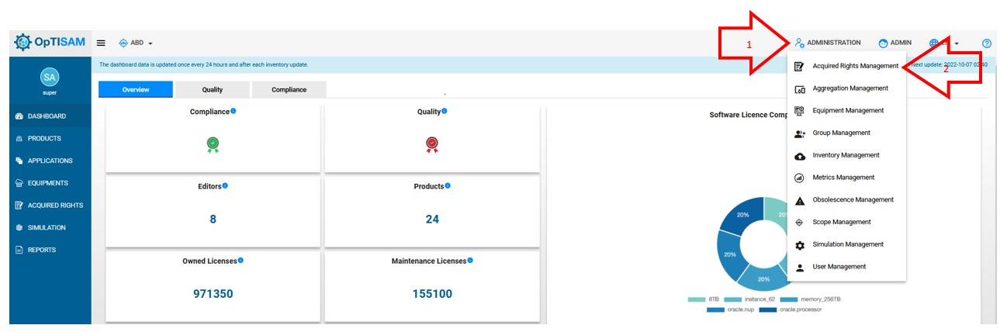
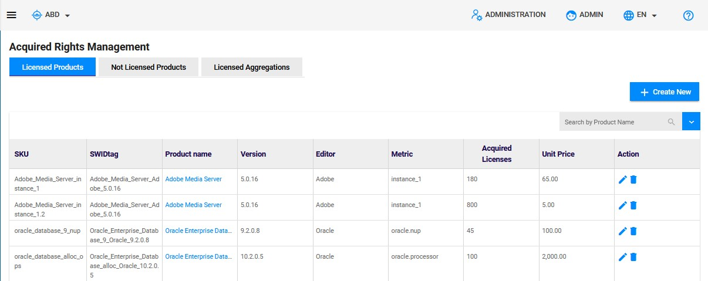
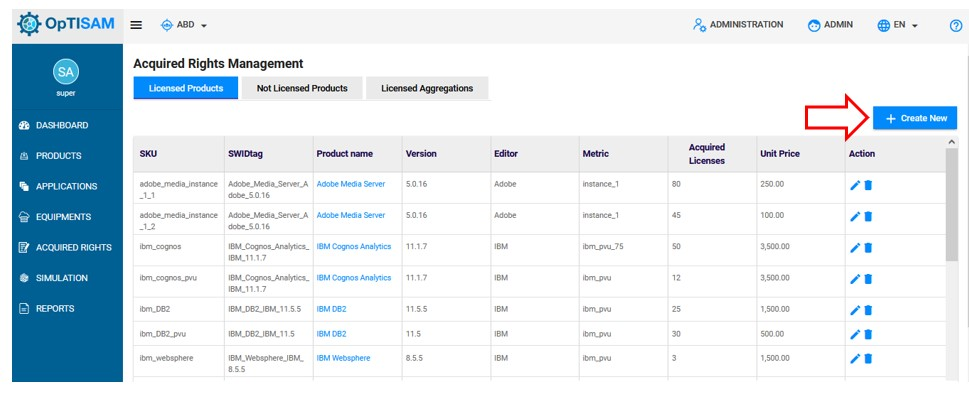
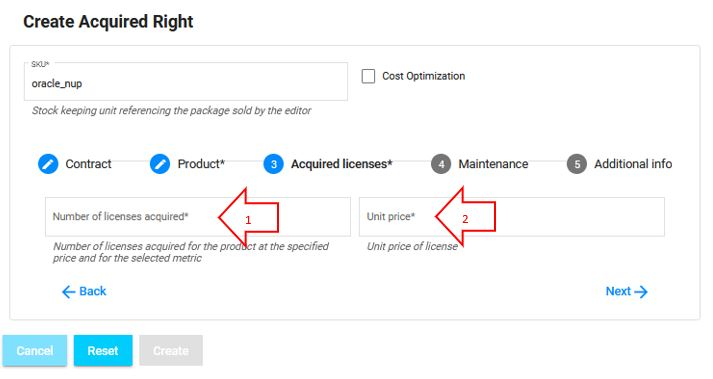
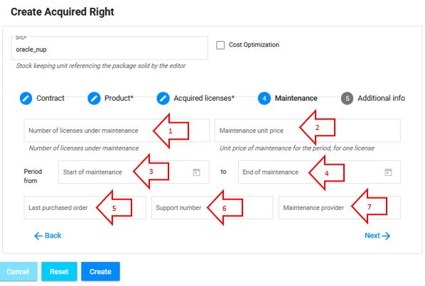

<link rel="stylesheet" href="../../../css/enlargeImage.css" />

# Acquired rights management

First, make sure that you are an admin and that you are working on the good scope :

{: .zoom}

## What is an acquired right ? 

An acquired right represent the licensing rights owned by a scope for a product.  

## Access

You can access to "Acquired rights management" by clicking here :

{: .zoom}

## Presentation

The presentation table will be displayed: 

{: .zoom}
  
The list of acquireds rights is ordered alphabetically.

There are different attributes :  
- SKU : The identifier of your acquired right  
- Product name : The name of the product (You can click on it to have more information about it)  
- Version / Editor : The version and the editor of the product  
- Metric : Name of the metric used for the acquired right  
- Acquired licenses : The number of licenses acquired
- Available Licenses : The number of licenses which can be shared
- Received Licenses : The number of licenses received from other entities
- Shared Licenses : The number of licenses shared with other entities
- Unit Price (€) : The unit price of licences in euros
- Action : Edit/Delete/Share   

**If you have 2 different "Acquired Rights" with different SKUs for the same product and the same metric, OpTISAM will automatically detect that the product has several SKUs and will only show the total in a single line in the compliance tab.**

## Possibilities

You can do 4 things from there :  
- Create a new acquired right ([here](#create-a-new-acquired-right))  
- Edit an acquired right ([here](#edit-an-acquired-right))  
- Delete an exiting aquired right ([here](#delete-an-existing-acquired-right))   
- Share an aquired right ([here](#share-an-aquired-right))

<!--[select APM](../../img/ARMana/possibilities.jpg){: .zoom} -->

## Create a new acquired right

Click on "Create New" button : 

{: .zoom}

This window will be displayed : 

{: .zoom}

You will have to fill in the fields (if needed, not mandatory):  
1. SKU : The id of the acquired right (mandatory)    
2. Ordering date : The date of the ordering  
3. Corporate sourcing contract : The name of the corporate sourcing the contract  
4. Software provider : The name of the software provider  
<!--5. Cost Optimization : Allow optisam to find the best repartition of licences amongs SKUs (for same product or aggregation) to optimize the delta (less counterfeiting and minimum delta).   
To activate the cost optimization, check the box "Cost Optimization"  -->

 
Then you can click on "Next" (5) or navigate with the 5 categories in the navigation bar  

The next screen is: 

{: .zoom}

You will have to fill in the fields (mandatory) :  

1. Product Editor : The editor of the product licensed by the acquired right. You can choose an existing editor proposed or add a new one.   
2. Product Name : The name of the product licensed by the acquired right. You can choose an existing product proposed or add a new one.       
3. Product Version : The version of the product licensed by the acquired right. You can choose an existing version of the product or add a new one.  
4. Metric : The metric(s) used to compute the licenses for the product.  
**You can select many metrics for the same acquired right**    

Then you can click on "Next" to continue or "Back" to modify the fields of the first step or navigate with the navigation bar. 

The next screen is : 

{: .zoom}

You will have to fill in the fields (mandatory) :  
1. Number of licenses acquired : The number of licenses acquired for the product with this acquired right  
2. Unit price : The unit price for each licenses acquired for the product with this acquired right  

Then you can click on "Next" to continue or "Back" to modify the fields of the second step or navigate with the navigation bar.  

**If you don't have any maintenance data or additional info to add, you can click on "Create" to create the Acquired Right.**  

The next screen is :  

{: .zoom}

You will have to fill in the fields (if needed, not mandatory) :  
1. Number of licenses under maintenance : The number of licenses that are under this maintenance during this period  
2. Maintenance unit price : The price of each license under maintenance during this period  
3. Start of maintenance : The date when the maintenance starts  
4. End of maintenance : The date when the maintenance ends  
5. Last purchased order : The date of the last purchase
6. Support number : The number of support
7. Maintenance provider : The name of the maintenance provider  
**If you don't enter the number of licenses under maintenance, you could not enter the start date and the end date of the maintenance.**

Then you can click on "Next" to continue or "Back" to modify the fields of the first 3 steps or navigate with the navigation bar.  
**If you don't have any additional info to add, you can click on "Create" to create the Acquired Right.**  

The next screen is :  

{: .zoom}

You will have to fill in the field of the comment (if needed, not mandatory) or add a pdf file by clicking on "browse". You will able to dowload or delete it later.

Then you can click on "Back" to modify the fields of the first 4 steps or navigate with the navigation bar.  
When you are done, click on "Create" to create the new acquired right.

When you upload a product without specified the aquired  right,the associated acquired right is created with default values in the Not licensed products tab as displayed below.

{: .zoom}

You can easily create an aquired right for the product by clicking on the plus icon which next it as displayed below.

{: .zoom}

After clicking, on the plus icon, you will see the frame of creation of an  aquired right as sawn above. The only differences are that the Product Editor, Product Name and Product Version field will be filled automatically as displayed below. 

{: .zoom}

You will have now to finish the creation by filling the others fields.

Once the aquired right create, the product will be remove from the not licences products to licenses proudcts.

## Edit an acquired right

Click on the pencil icon next to the Acquired Right that you want to edit : 

{: .zoom}

This window will be displayed : 

{: .zoom}

From there, you will be able to edit everything in all tabs except the SKU.  
<!--
In this first screen, you will be able to edit :    
- Product Editor : The editor of the product licensed by the acquired right  
- Product Name : The name of the product licensed by the acquired right  
- Product Version : The version of the product licensed by the acquired right  
- Metric : The metric used to compute the licenses for the product  

{: .zoom}

In this second screen, you will be able to edit :  
- Number of licenses acquired : The number of licenses acquired for the product with this acquired right  
- Unit price : The unit price for each licenses acquired for the product with this acquired right  

{: .zoom}

In this third screen, you will be able to edit (if needed, not mandatory) :  
- Number of licenses under maintenance : The number of licenses that are under this maintenance during this period  
- Maintenance unit price : The price of each license under maintenance during this period  
- Start of maintenance : The date when the maintenance starts  
- End of maintenance : The date when the maintenance ends  
**If you don't enter the number of licenses under maintenance, you could not enter the start date and the end date of the maintenance.**

{: .zoom}

In this last screen, you will be able to edit the commentary (if needed, not mandatory).
-->
When you are done, click on "Update" to edit the acquired right.

## Delete an existing acquired right

Click on the trash icon next to the acquired right that you want to delete :

{: .zoom}

This window will be displayed:

{: .zoom}

You have to click on "OK" to delete the acquired right.

## Share an aquired right

Click on the share icon next to the Acquired right that you want to share : 

{: .zoom}

This window will be displayed : 

{: .zoom}

1. Choose the scope to which to share the acquired right
2. Choose the number of acquired license to share
3. Click on "Add More", to add an other scope with which to share the license
4. Click on "Share" to share the license

Once done, you can see the information about the acquired right shared:

{: .zoom}

The acquired rights shared are no longer available taken account for the computation of compliance for the current entity but remain owner of the licenses. The entity that received the licenses can see them in their acquired right list and are taken account for the computation of compliance. 

Notice that the acquired right of aggregations can also be  shared. Just click on "Licensed Aggregation" to go to aggregation section and follow the same steps as seen above. 

