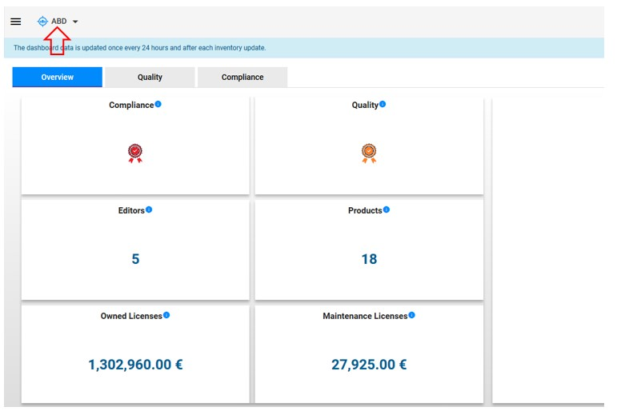
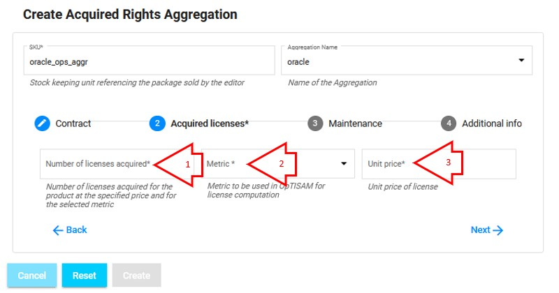

<link rel="stylesheet" href="../../../css/enlargeImage.css" />

# Acquired rights aggregation management

First, make sure that you are an admin and that you are working on the good scope :

{: .zoom}

## Access

You can access to "Acquired rights aggregations management" by clicking here :

{: .zoom}

Then this page will be shown:   

{: .zoom} 

You have to click on "Licensed Aggregations" to access to acquired rights aggregations management.

{: .zoom} 

## Presentation

The presentation table is : 

{: .zoom}

You can see :  
- SKU: The indentifier of the aggregation
- Aggregation name : The name of the aggregation  
- Products : The list of the products in the aggregation  
- Editor : The editor of the products in the aggregation  
- Metric Name : The metrics of the products in the aggregation  
- Number of SWIDTags : The number of SWIDTags in the aggregation  
- Acquired Licenses: The number of acquired licenses    
- Unit price: The price of one acquired license
- Action : edit/delete

## Possibilities

You can do 3 things from there :  
- Add a new aggregation ([here](#add-a-new-aggregation))  
- Edit an existing aggregation ([here](#edit-an-existing-aggregation))  
- Delete an existing aggregation ([here](#delete-an-existing-aggregation))   

{: .zoom}  

When many switags of the aggregation reference the same product, this product is diplayed only once.

## Add a new aggregation

You have to click on "Create new" : 

{: .zoom}
This window will be shown : 

{: .zoom}

You can see these different fields :  
- SKU: The identifier of the aggregation
- Aggregation name : The name of the new aggregation  
- Ordering date: The date of the contract order
- Corporate sourcing contract : The name of the corporate which sources the contract
- Software provider : The name of software provider
<!-- 
- Editor : Select the editor on which you want to create an aggregation  
- Metrics : Select the metric on which you want to create an aggregation  
- Product : Select the products on which you want to create an aggregation  
-->
Once you have  filled the SKU, the Aggregation name and the informations about the contract if applicable as shown below : 

Notice that for the aggregation name, you have to choose among products aggregations that you already have. 

{: .zoom}

You can click on "Next" to move to acquired licenses or navigate with the 4 categories in the navigation bar  

{: .zoom}

Notice that, you can combine many metrics, except oracle NUP and processor</sapn>

<!--
You are able to choose the products that you want to add to your aggregation by SWIDTags.  

All products choosen will be add at the left, in the green box.  
To add definitively the products to the aggregation, click on the green button(plus) of each products.  

After that, you can see the all the products at the right, in the blue box. 

You can remove a product of the aggregation by clicking on the red button(minus).   

Once it's done, you can click on "Next" to move to acquired licenses or navigate with the 5 categories in the navigation bar  
-->

You will have to fill in the fields (mandatory) :  
1. Number of licenses acquired : The number of licenses acquired for the product with this acquired right  
2. Mertric : The metric(s) use the aggregation
3. Unit price : The unit price for each licenses acquired for the product with this acquired right  

Then you can click on "Next" to continue or "Back" to modify the fields of the first step or navigate with the navigation bar.  
**If you don't have any maintenance data or additional info to add, you can click on "Create" to create the Acquired Rights Aggregation.**  

The next screen is :  

{: .zoom}

You will have to fill in the fields (if needed, not mandatory) :  
1. Number of licenses under maintenance : The number of licenses that are under this maintenance during this period  
2. Maintenance unit price : The price of each license under maintenance during this period  
3. Start of maintenance : The date when the maintenance starts  
4. End of maintenance : The date when the maintenance ends  
5. Last purchased order : The date of the last purchased order
6. Support number : The number of support
7. Maintenance provider : The name of the maintenance provider  

**If you don't enter the number of licenses under maintenance, you could not enter the start date and the end date of the maintenance.**

Then you can click on "Next" to continue or "Back" to modify the fields of the first 2 steps or navigate with the navigation bar.  
**If you don't have any additional information to add, you can click on "Create" to create the Acquired Right Aggregation.**  

The next screen is :  

{: .zoom}

You will have to fill in the field of the comment (if needed, not mandatory) or add a pdf file if needed by clicking on "Browse". You will able to download or delete it later.

Then you can click on "Back" to modify the fields of the first 3 steps or navigate with the navigation bar.  
When you are done, click on "Create" to create the new acquired rights aggregation.

Notice that, you can create many SKUs for an existing product aggregation <!-- but you cannot add another SKU with oracle NUP metric if oracle processor  already exists reciprocally-->.

See the exemple below: 

{: .zoom}

## Edit an existing aggregation

You have to click here to edit an existing aggregation : 

{: .zoom}

This window will be shown : 

{: .zoom}

You can change all the attributes except the SKU.

Once it's done, you can click on "Update" and the aggregation will be updated ! 

## Delete an existing aggregation

You have to click here to delete an existing aggregation : 

{: .zoom}

This window will be shown : 

{: .zoom}

You just have to click on "OK" to delete the aggregation !

