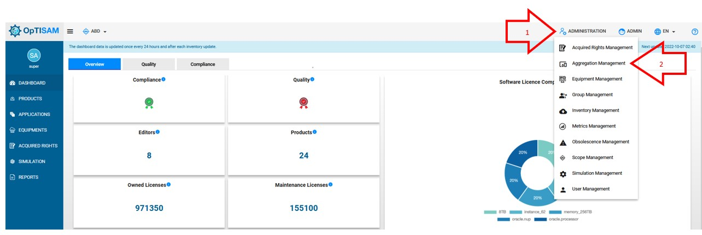

<link rel="stylesheet" href="../../../css/enlargeImage.css" />

# Aggregations management

First, make sure that you are an admin and that you are working on the good scope :

{: .zoom}

## What is an aggregation ? 

This is a group of several products, covered by the same license. When a product is used on different equipments with different versions, we can create an aggregation with this set of products if a same license covers all of these versions.  

## Access

You can access to "Aggregations management" by clicking here :

{: .zoom}

## Presentation

The presentation table is : 

{: .zoom}

You can see :  

- Aggregation name : The name of the aggregation  
- Products : The list of the products in the aggregation  
- Editor : The editor of the products in the aggregation  
- Metric Name : The metrics of the products in the aggregation  
- Number of SWIDTags : The number of SWIDTags in the aggregation  
- Action : edit/delete

## Possibilities

You can do 3 things from there :  
- Add a new aggregation ([here](#add-a-new-aggregation))  
- Edit an existing aggregation ([here](#edit-an-existing-aggregation))  
- Delete an existing aggregation ([here](#delete-an-existing-aggregation))   

{: .zoom}  

When many switags of the aggregation reference the same product, this product is diplayed only once.

## Add a new aggregation

You have to click on "Add aggregation" : 

{: .zoom}

This window will be shown : 

{: .zoom}

You can see these different fields that you have to fill :  
- Aggregation name : The name of the new aggregation  
- Editor : The editor on which you want to create the aggregation   
- Product : The products on which you want to create the aggregation  

Once you have filled the Aggregation name, you have to choose the editor and the products among those shown when you click on "Editor" and "Product"

{: .zoom}

Once the editor chosen, You are able to choose the products that you want to add to your aggregation by SWIDTags.  

All products choosen will be add at the left, in the green box.  
To add definitively the products to the aggregation, click on the green button(plus) of each products.  

After that you can see the all the products at the right, in the blue box. 

You can remove a product of the aggregation by clicking on the red button(minus).   

Once it's done, you can click on Save to create your aggregation. 

## Edit an existing aggregation

You have to click here to edit an existing aggregation : 

{: .zoom}

You will able to edit all the attributes of the aggregation. 

Once it's done, click on "Update" to save your changements. 

## Delete an existing aggregation

You have to click here to delete an existing aggregation : 

{: .zoom}

This window will be shown : 

{: .zoom}

You just have to click on "OK" to delete the aggregation !

