<link rel="stylesheet" href="../../../css/enlargeImage.css" />

# Concurrent users

## What are the concurrent users?

Unlike to the [nominative user](nominativeUsers.md), concurrent users are a group of users using the same product.  

## Access

You can access to "concurrent users" by clicking here :

This page will be displayed:

Then click on "concurrent Users", to access to concurrent users section

## Possibilities

From there, you have many possibilities :

- Add a new concurrent user ([here](#add-a-new-concurrent-user))  
- Edit an existing concurent ruser ([here](#edit-an-existing-concurrent-user))  
- Delete an existing concurrent user ([here](#delete-an-existing-concurrent-user))  
- Export concurrent users report ([here](#export-concurrent-users-report)) 
- Check the history of concurrent product users ([here](#check-the-history-of-concurrent-product-users))

## Add a new concurrent user 

First make sure that you are an admin and in concurrent users section:

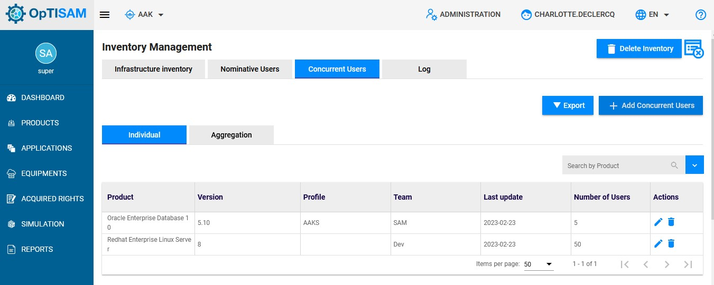{: .zoom}

To add a new concurrent user, you have to click on " Add concurrent Users":

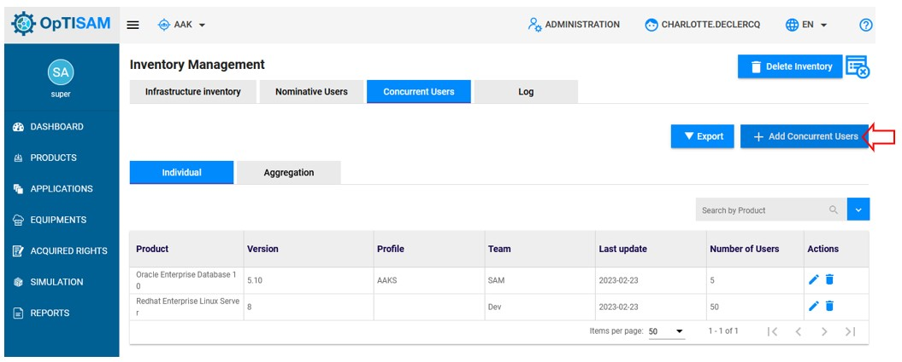{: .zoom}

This page will be displayed : 

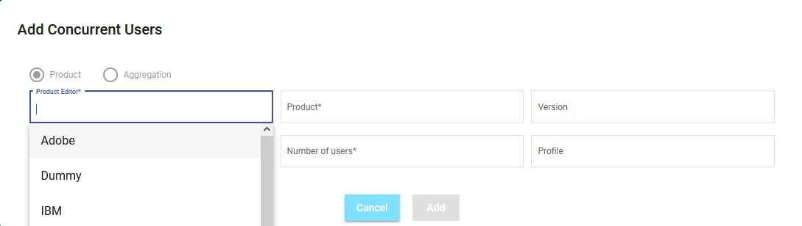{: .zoom}

You will have to fill the different fields as on the page below:

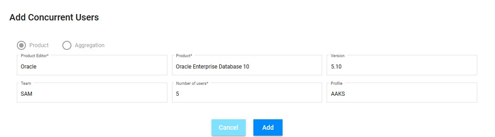{: .zoom}

Once done, click on "Add" to add the concurrent user.

Notice that this example is for a single product, but it can used for aggregation by using "Aggregation" section. 

## Edit an existing concurrent user

To edit an existing concurrent user, click on the pencil icon located on the same line of the concurrent user to edit

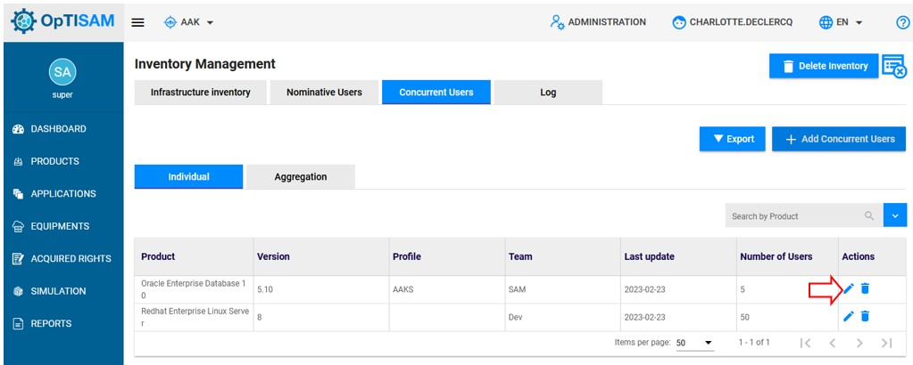{: .zoom}

A page containing the concurrent users information will be displayed

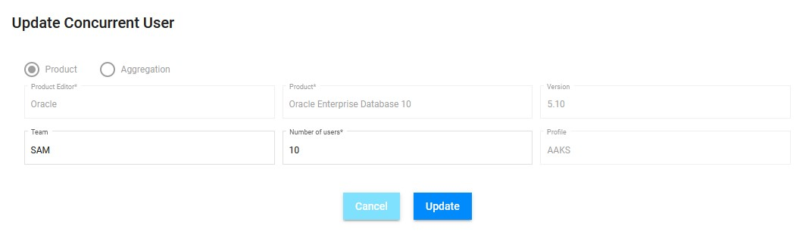{: .zoom}

You can edit only the "Team" and the "Number of users".

Once done, click on "Update" to save your changes. 

Notice that this action is applicable for aggregations. 

## Delete an existing concurrent user

To delete an exiting concurrent user, click on the trash icon located on the same line of the concurrent user to delete. 

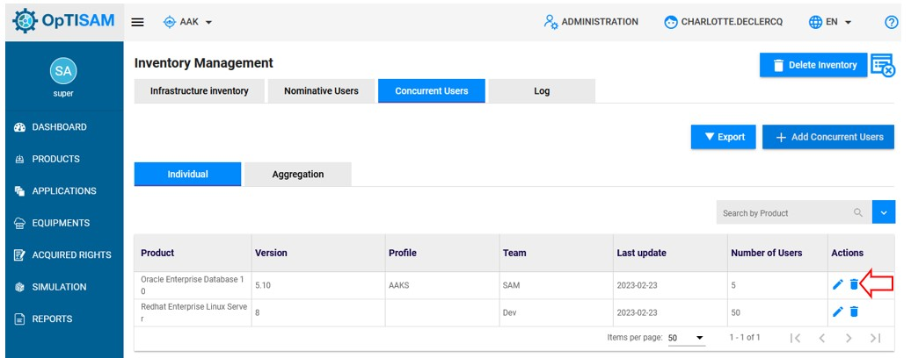{: .zoom}

This pop up will be displayed:

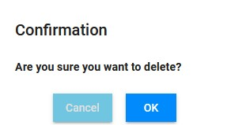{: .zoom}

Click on "OK" to confirm your deletion. 

Notice that this action is applicable for aggregations. 

## Export concurrent users report

To get a report of concurrent users, click on "Export" 

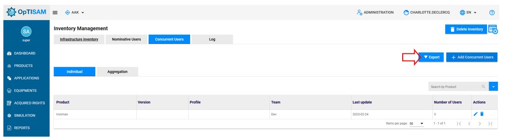{: .zoom}

A file will be downloaded.

Notice that this action is applicable for aggregations. 

## Check the history of concurrent product users

To get the history of concurrent product users, follow these steps:

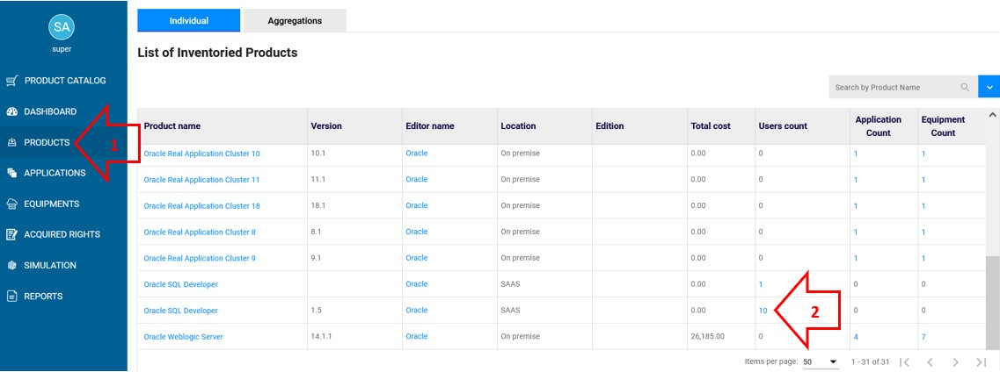{: .zoom}

1. First go on product, then find the product that you whant to check the conccurents users. 
2. Click on the number of users count.
3. Once done, go to the concurrent users section to find the history as displayed below:

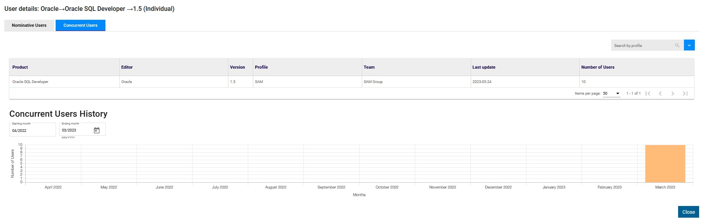{: .zoom}

