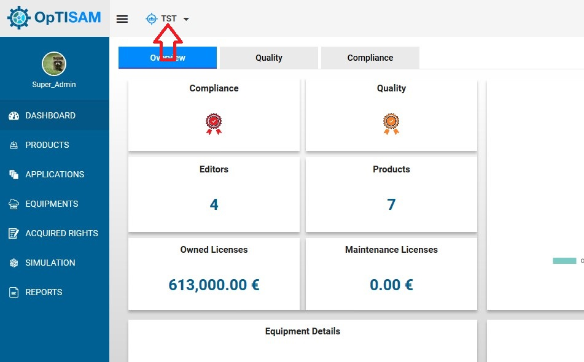
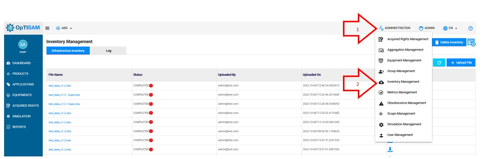
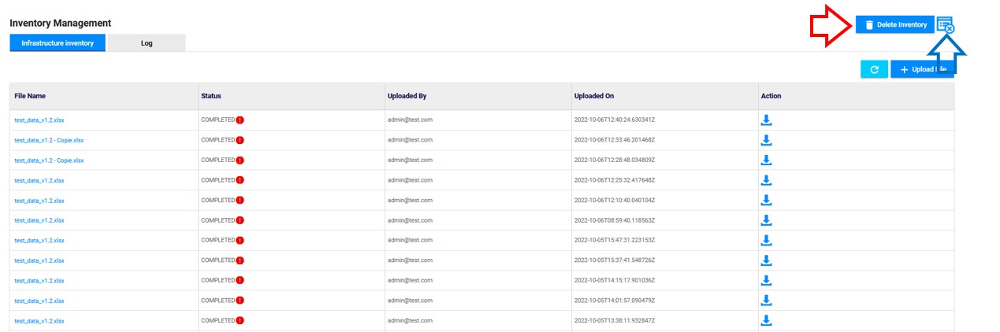

<link rel="stylesheet" href="../../../css/enlargeImage.css" />

# Delete the inventory data

First, make sure that you are an admin and that you are working on the good scope :

{: .zoom}

## Access to the page

1. Click on "Administration"
2. Click on "Inventory Management" 

{: .zoom}

## Possibilities

You can do 2 things from there :  
- Delete the data ([here](#delete-the-data))  
- Check the deletions history and status ([here](#check-the-deletions-history-and-status))  

{: .zoom}

## Delete the data

Click on "Delete Inventory" : 

{: .zoom}

This window will be shown :

{: .zoom}

On this window, you can select :  
1. Inventory Park : It will delete the equipments, the applications and the products  
2. Acquried Rights : It will delete all of the acquired rights  
You can also select both in order to delete everything.

When you have selected what to delete, click on "OK" in order to delete.  

Be careful, if a deletion or an injection is already running, an error message will be shown, and you will not be able to delete your data.

## Check the deletions history and status

Click on this icon :  

{: .zoom}

This window will be shown : 

{: .zoom}

There, you will find all the deletions history :  
- Data : The part of data that has been deleted (Whole inventory, Acquired Rights or Inventory Park)  
- Requester : The user that has requested the deletion  
- Status : The status of the deletion (INPROGRESS, FAILED, SUCCESS)  
- Date : The date of the deletion  

