<link rel="stylesheet" href="../../../css/enlargeImage.css" />

# Equipments management

First, make sure that you are an admin and that you are working on the good scope :

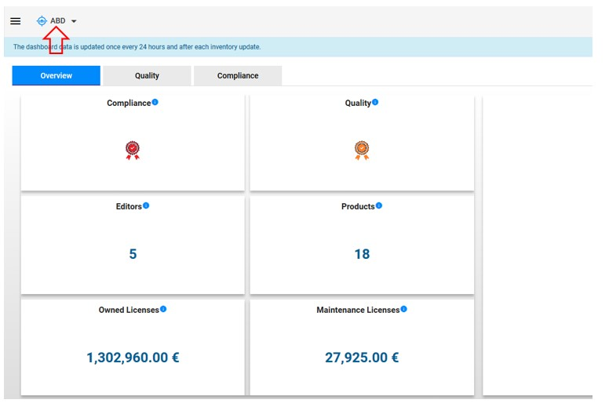{: .zoom}

## What is an equipment ? 

An equipment is a part of the park where products are installed. A physical or virtual machine on which are installed some products. All equipments in OpTISAM are link together thanks to a hierarchy (parent/child).

## Access

You can access to "Equipment management" by clicking here :

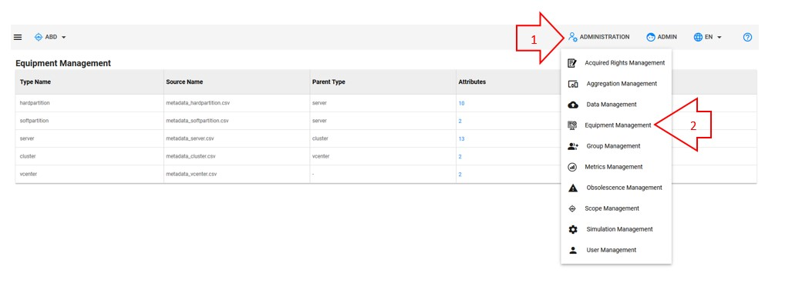{: .zoom}

## Possibilities

You can do 3 things from there :  
- Add a new equipment type ([here](#add-a-new-equipment-type))  
- Edit an existing equipment type ([here](#Edit-an-existing-equipment-type))  
- See the details of an existing equipment type ([here](#see-the-details-of-an-existing-equipment-type))  

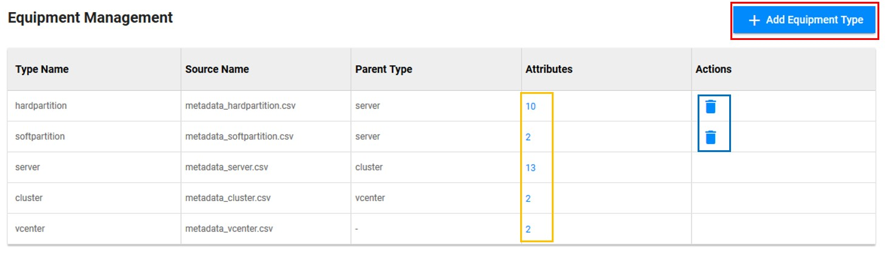{: .zoom}

## Add a new equipment type (only for specific scopes)

### Example of metadata file

In order to build a metadata file, you must know the attributes of the equipment type that you want to create.  
Then you have to create a CSV file with all of the attributes. Let's take an example :  

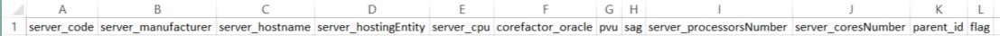{: .zoom}

In this screenshot, you can see the metadata_server.csv with all of the attributes :  
- server_code [...] server_coresNumber : Attributes of the server  
- parent_id : The id that will be mapped to the parent of server (here "cluster")  

This metadata files must be CSV with ";" separator, a "UTF-8" encoding and no spaces or special characters.  

Example :  
- You can download all the metadata files for the generic template [here](../../excel/metadata.zip) as an exemple  
In the case of these files the cluster is the parent of the server for example.  

### Import the metadata file(s) 

You have to import a CSV metadata file that contains all the attributes of your new equipment including including the foreign key refering to the primary key of his parent if it has one (e.g : in the metadata file of "servers", there must be an attribute "cluster_code" refering to the cluster that contains the "server").  

**An equipment type can only have ONE and only ONE parent.**

In order to do this, go to "Data Management" and "Metadata" :

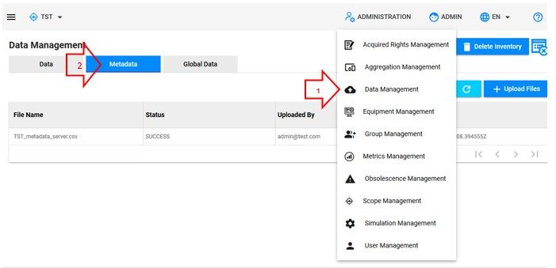{: .zoom}

Click on "Upload Files" :

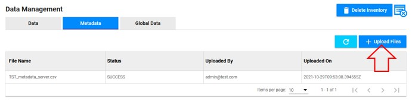{: .zoom}

Click on the "Browse" button and select the CSV metadata file(s) (you can upload multiple files at the same time).

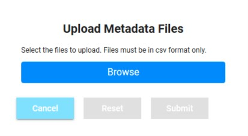{: .zoom}

Click on "Submit" when you have selected all the files that you want to upload.

### Create the new equipment type

Once you have uploaded the metadata file for your equipment, you can create the equipment in optisam. For that, go back to "Equipment Management" :

{: .zoom}

Add the equipment types in the right order so you can select the "Parent" (e.g : if a cluster contains servers, start by adding "cluster", then add "server", and so on).

Click on "Add Equipment Type" : 

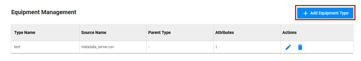{: .zoom}

You will have this screen :

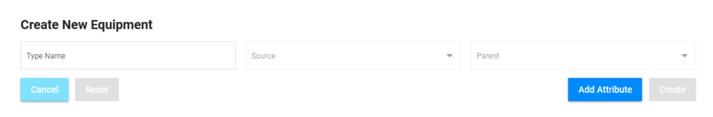{: .zoom}

You can see these different fields :  
- "Type Name" : Write the name of your choice for your new equipment type  
- "Source" : Choose the metadata file that defines your new equipment type  
- "Parent" : Choose the parent of your new equipment type (if it has one)

Once you have filled in all the fields, you can click on "Add Attributes" to add a new attribute to your new equipment type and you will see this :

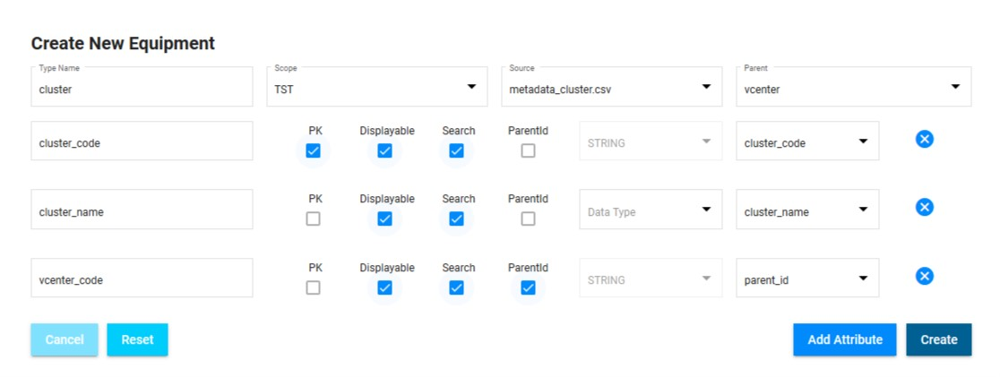{: .zoom}

In the different fields :  
- "Attribute Name" : Write the name of your choice for the new attribute (without spaces or special characters)  
- "Primary Key" : Tick it if this is the primary key of your equipment type  
- "Displayable" : Tick it if you want to have this attribute displayed in the table of equipment type  
- "Search" : Tick it if you want to be able to search your equipment type by this attribute  
- "ParentId" : Tick it if the attribute is the ID of your equipment type's parent  
- "Data Type" : Choose "int", "float" or "string" depending on the attribute  
- "Mapped to" : Choose the column of the "Source" file to which the attribute refers  

In the example from the screenshot above, the new equipment type is cluster (its parent is the equipment type "vcenter") and its attributes are :   
- cluster_code : Primary key (displayable and searchable) refers to "cluster_code" in the CSV file  
- cluster_name : The name of the cluster (displayable and searchable) that refers to "cluster_name" in the CSV file  
- vcenter_code : The ID of the parent vcenter (displayable and searchable) that refers to "parent_id" in the CSV file  

Then click on :  
- "Add Attribute" if you want to add another attribute  
- "Create" if you have added all of the attributes  

When you click on "Create", it's over, you have created a new equipment type !

## Edit an existing equipment type (only for specific scopes)

If you want to edit an existing equipment type, you will have this screen :

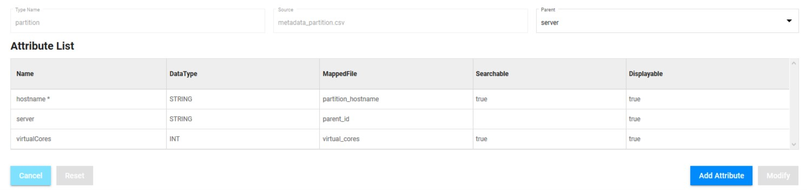{: .zoom}

From there, you can click on "Add Attribute" to add an attribute, you can follow the same guide as in "Add a new equipment type" but you will have to validate by clicking "Modify" instead of "Create".

## See the details of an existing equipment type

You can check all of the attributes of your equipment type and their details :

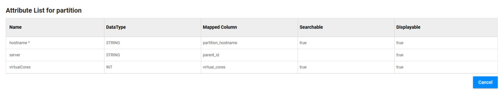{: .zoom}

