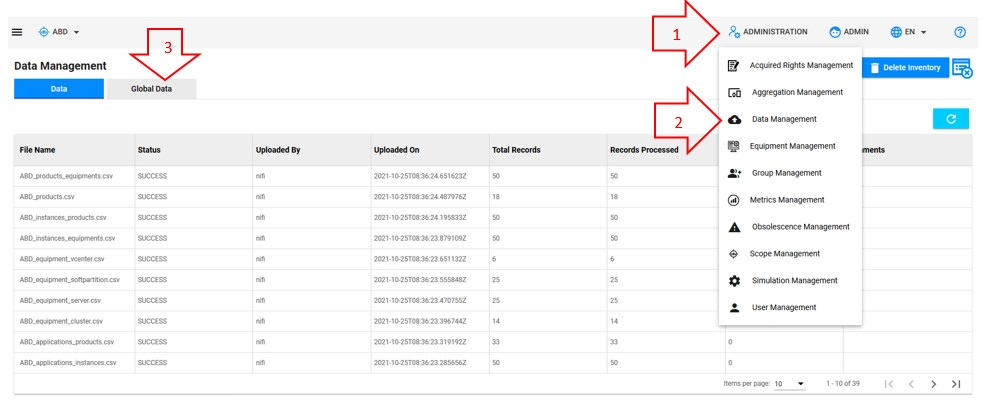
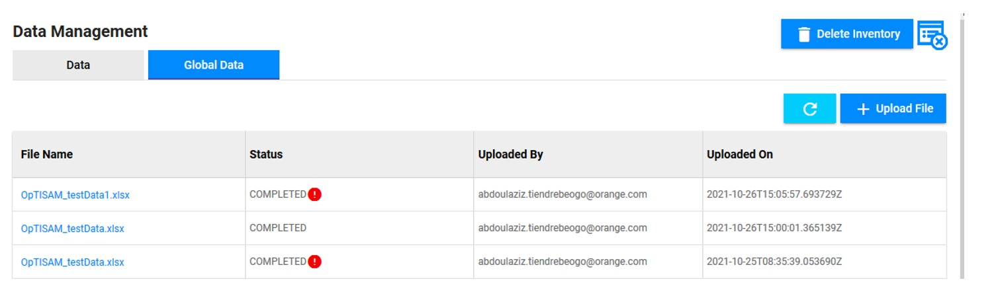
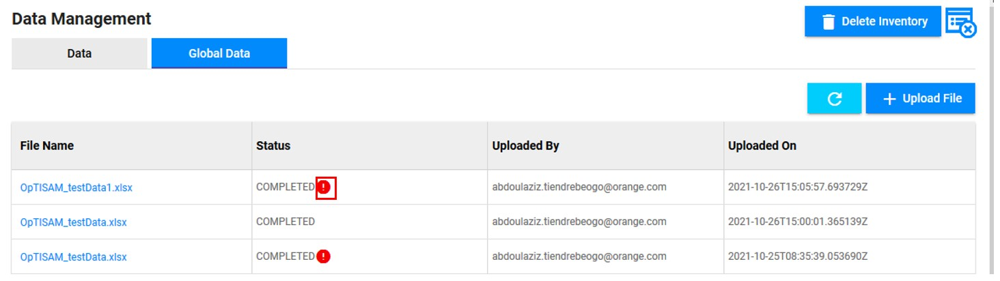
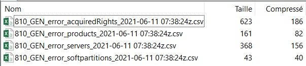
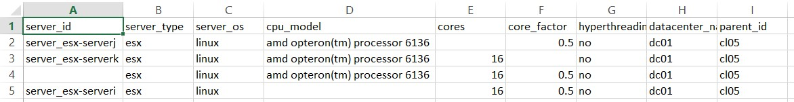

<link rel="stylesheet" href="../../../css/enlargeImage.css" />

# Importation errors management

First, make sure that you are working on the good scope :

{: .zoom}

## Access to the page

1. Click on "Administration"
2. Click on "Data Management" 
3. Click on "Global Data" 

{: .zoom}

## Check if there is any error

{: .zoom}

If there is a red exclamation mark in front of the "COMPLETED" in the line of the file that you've just imported, then this significates that you have at least one error in your file.

If there isn't any red exclamation mark, then your file has been completely imported without errors.

## Check what are the errors

You have to click on the red excalamation mark, in order to download an archive that contains CSV files that correspond to your importation : 

{: .zoom}

Save this file and unzip it with the unzipper of your choice (e.g. : 7zip) : 

{: .zoom}

You will have 4 files containing the lines that contains one or more errors : 

{: .zoom}

For example, as you can see in my "errors_servers" file, I have the 4 lines that has an error per line :  
- No "cores" : that is a mandatory field  
- No "core_factor" : that is a mandatory field  
- No "server_id" : that is a mandatory field  
- No "cpu_model" : that is a mandatory field  

Knowing that, you can correct your file and import it again without errors.

