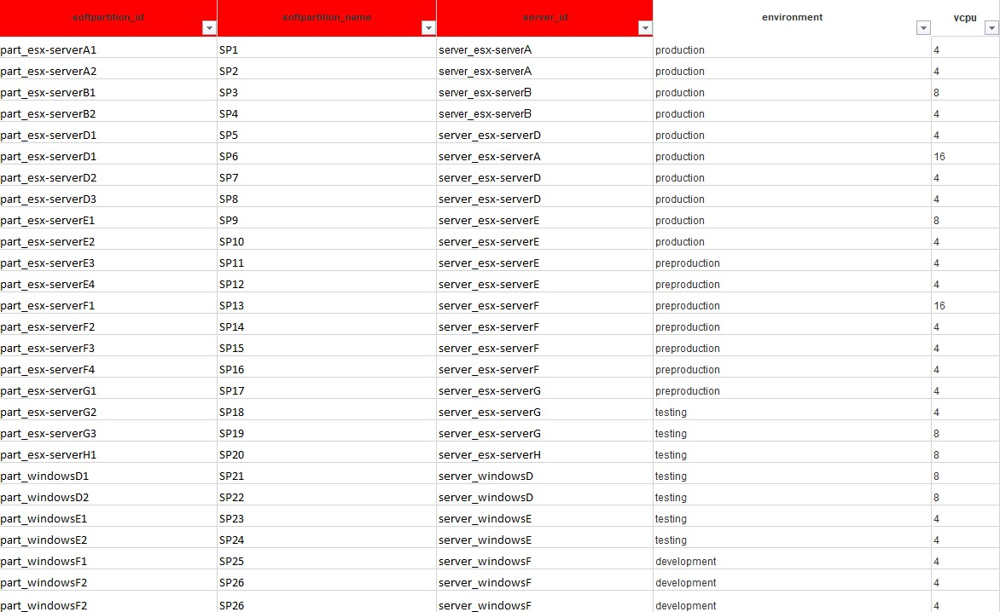
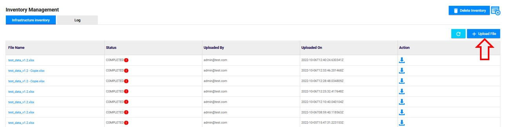
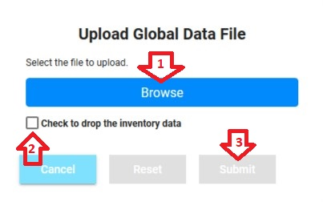

<link rel="stylesheet" href="../../../css/enlargeImage.css" />

# Upload all of your data in one global file

First, make sure that you are an admin and that you are working on the good scope :

{: .zoom}

**You can click [here](#access-to-the-page) if you already have your file completed.**

**You can go [here](../dataManagement) if you want to delete the inventory.**

**You can go [here](../errorData) if you want to check if you have errors in your import and to see which are they.**

**You can upload all your inventory in one an only file, following the structure of a template to fill in.**

## Examples of generic template

[Here](../../excel/genericTempWithoutData.xlsx), you can find an example of the generic template without data.  
[Here](../../excel/genericTempWithData.xlsx), you can find an example of a completed generic template.  

The generic template is also available directly in OpTISAM on the "Global Data" upload screen :  

{: .zoom}

In this template, you will find 4 tabs :  

- [servers](#servers) : Contains the servers and all the information about it  

- [softpartitions](#soft-partitions) : Contains the soft partitions and all the information about it   

- [products](#products) : Contains all the products and on which resource it is installed. (As of v0.2.6 : ) 

- [applications](#applications) : Contains all the applications where products are used

- [acquiredRights](#acquired-rights) : Contains all the information about the rights regarding the products  

### Servers

{: .zoom}

In this tab, you will find (in red the mandatory attributes) :  

- server_id : The id of the server  

- server_name : The name of the server

- server_type : The type of the server (e.g : esx, baremetal, AIX, Solaris)  

- server_os : The operating system of the server (e.g : linux, solaris, aix, 
windows) 

- cpu_manufacturer: The name of the precessor manufacturer 

- cpu_model : The CPU model of the server    

- server_processors_number : The total number of the processors of the server  

- cores_per_processor : The total number of physical cores per processor of the server  

- hyperthreading : Is the hyperthreading activated on the server  

- cluster_name : The id of the cluster containing your server (mandatory only if it exists)  

- vcenter_name : The id of the vcenter containing your cluster (mandatory only if it exists)  

- vcenter_version : The version of the vcenter (only for ESX servers)  

- datacenter_name : The id of the datacenter containing your vcenter  

- ibm_pvu : (mandatory if ibm products installed)

- sag_uvu : (mandatory if sag products installed)

- environment: The environment where the server is used

<!-- - oracle_core_factor : The core factor given by Oracle ([here](https://www.oracle.com/us/corporate/contracts/processor-core-factor-table-070634.pdf)) corresponding to the CPU model of your server (mandatory if oracle products installed)
-->

### Soft Partitions

{: .zoom}

In this tab, you will find (in red the mandatory attributes) :  

- softpartition_id : The id of the soft partition  

- softpartition_name : The name of the softpartition

- server_id : The id of the server containing the partition  

- environment : The environment where the softpartition is deployed

- vcpu : The number of processor of the softpartition

### Products

{: .zoom}

In this tab, you will find (in red the mandatory attributes) :  

- product_name : The name of the product    

- product_editor : The editor of the product  

- product_version : The version of the product  

- host_id : The id of the host on which is installed the product (must reference a capped or uncappedResource)    

- allocated_metric: metric dedicated to the product

- alocated_users: number of users who have access to the product
<!--
- number_of_access : The number of access to the application using the product on the line. Mandatory only if the metric is using it (e.g. : Oracle NUP)  
-->
### Applications

{: .zoom}

- application_name : The name of the application using the product on the line  

- application_instance_name : The name of the instance of the application using the product on the line  

- application_id : The id of the application using the product on the line  

- domain : The business domain of the application using the product on the line  

- environment : The environment of the application using the product on the line (must be "Production" or "Development")  

- product_name : The name of the product    

- product_editor : The editor of the product  

- product_version : The version of the product  

- host_id : The id of the host on which is installed the product (must reference a capped or uncappedResource)  

### Acquired Rights

{: .zoom}

In this tab, you will find (in red the mandatory attributes) :  
- sku : The sku of the acquired right  
- product_name : The name of the product of the acquired right  
- product_version : The version of the product of the acquired right  
- product_editor : The editor of the product of the acquired right  
- licence_type : The type of the licence of your acquired right  
- metric : The metric used to compute the acquired right  
- acquired_licenses : The number of acquired licenses of the acquired right  
- unit_price : The unit price of a licence of the acquired right  
- maintenance_licences : The number of maintenance licenses of the acquired right  
- maintenance_unit_price : The unit price of a maintenance licence of the acquired right  
- maintenance_start : The date of the maintenance start  
- maintenance_end : The date of the maintenance end  

## Access to the page

1. Click on "Administration"
2. Click on "Inventory Management" 

{: .zoom}

## Upload the file

Click on "Upload File" : 

{: .zoom}

1. Click on "Browse" to select the file that you want to upload
2. Check the box if you want to delete the current inventory data 
3. Click on "Submit"

{: .zoom}

Be careful, if a deletion or an injection is already running, an error message will be shown, and you will not be able to import your data.

Once the file is uploaded, you will see it in the table below the button : 

{: .zoom}

 Notice that you can download the file injected by clicking on the download icone as shown below.  

{: .zoom}

## Data processing

Once your file has appeared in the table, as shown above, it will be processed by an ETL tool used to transform your data and separate them in different files from the original file you have uploaded. This transformation lasts 5 minutes. In order to see the files (generated by the transformation) that have been loaded into OpTISAM to update your inventory, click on the name of your file in the "Global Data" tab, it will take you to the "Data" tab :  

{: .zoom}

In this table, you can see if the records have been processed and how much have been processed.

For example, when you upload a file, you will have these files generated :  
First, it creates files that refer to the products / applications / acquired rights :  
- applications.csv : Applications data  
- applications_instances.csv : Linking of application and instances  
- applications_products.csv : Linking of applications and products  
- instances_equipments.csv : Linking of instances and equipments  
- instances_products.csv : Linking of instances and products  
- products_equipments.csv : Linking of products and equipments  
- product_acquiredRights.csv : All the acquired rights data and acquired rights and products linking  
- products.csv : Products data as well as linking (child of relation) of products with other products  

Then, it creates files that refer to the equipment (1 by equipment type) :  

- equipment_vcenter.csv : All the vcenters and the linking to their parent  
- equipment_cluster.csv : All the clusters and the linking to their parent  
- equipment_server.csv : All the servers and the linking to their parent  
- equipment_softPartition.csv : All the soft partitions and the linking to their parent  

Further details on all of these files : [here](../../managing/rawData)

