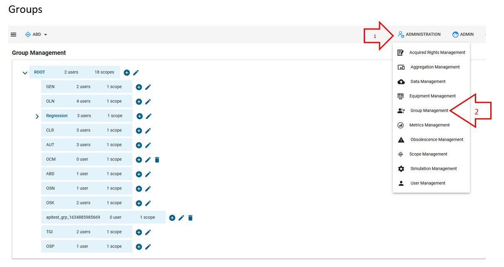
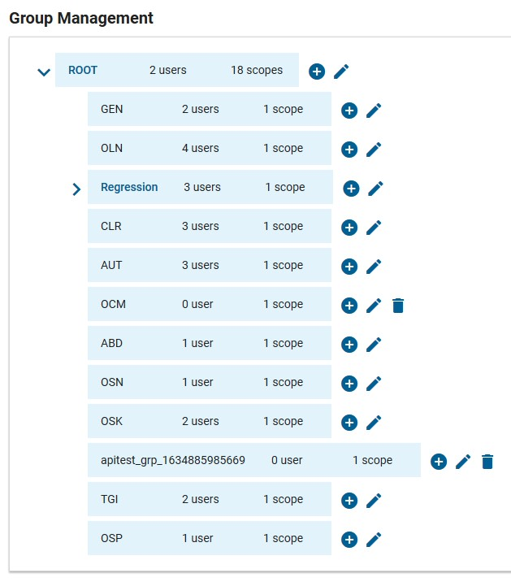
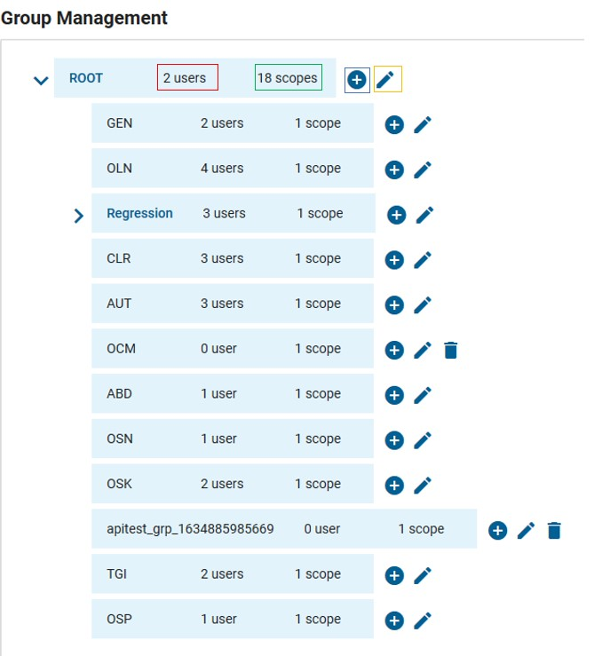
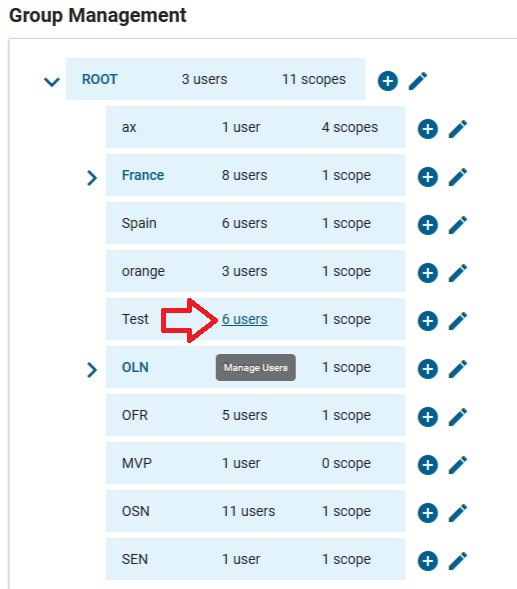
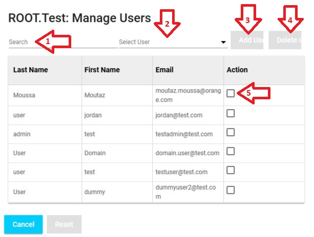
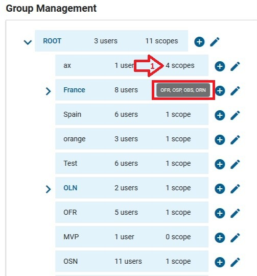
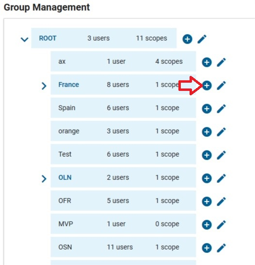
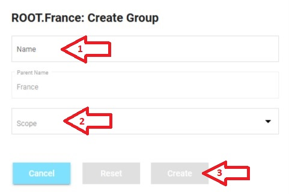
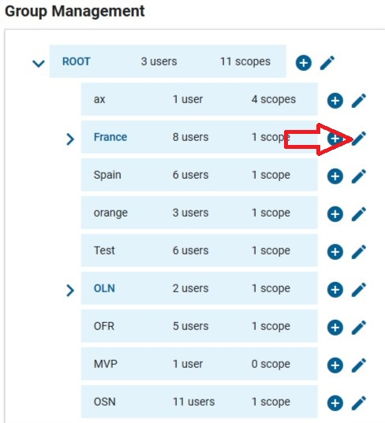
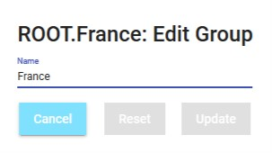

<link rel="stylesheet" href="../../../css/enlargeImage.css" />

# Groups management

First, make sure that you are an admin

## What is a group ?

Group enables access to one or more scopes. Group in OpTISAM context is logical grouping of 2 or more scopes. Each user belong to one or more groups. Group provides mechanism to have a user linked with multiple scopes. A user can see the park linked to all the scopes of its groups.

## Access

You can access to "Groups Management" by clicking here :

{: .zoom}

## Presentation

The presentation tree is : 

{: .zoom}

You see can all the groups as :  
1. "ROOT" : Group that represents the whole OpTISAM application  
2. "ax", "France", "Spain", etc : Represents all the groups  
3. "regression", etc : Represents the subgroups within the groups  

## Possibilities

You can do 4 things from there :  
- Manage the users of an existing group ([here](#manage-the-users-of-an-existing-group))  
- See the scopes that an existing group can access  ([here](#see-the-scopes-that-an-existing-group-can-access))  
- Create a new group ([here](#create-a-new-group))  
- Edit the name of an existing group ([here](#edit-the-name-of-an-existing-group))  

{: .zoom}

## Manage the users of an existing group

You have to click here to manage the users of the group on the line (e.g : Group "Test") : 

{: .zoom}

This screen will be shown : 

{: .zoom}

Here, you can :

1. Search for users in the below list  
2. Select a user from another group to add it to the group  
3. Click here to add a user that you would have selected in the list of the arrow 2  
4. Delete a user from the group that you would have selected from the below list  
5. Select a user to delete by clicking on the button of the arrow 4  

## See the scopes that an existing group can access 

You have to mouse-over at this place (1), and the list will show as on the screenshot below :  

{: .zoom}

## Create a new group

You have to click on the + button in front of the group that you want to create a group in (e.g : create a group in "France" group) : 

{: .zoom}

This screen will be shown : 

{: .zoom}

You have to fill in the fields :  
1. Name : The name of the group you want to create  
2. Scope : Select the scopes that you want this group to be able to see (it will only offer the scopes available in the group you're creating your new group)

Then you have to click on "Create" to create the new group.

## Edit the name of an existing group

Tou have to click on the pen button in front of the group that you want to edit the name :  

{: .zoom}

This screen will be shown : 

{: .zoom}

You can write the new name that you want and click on "Update" to edit the name of the group.

