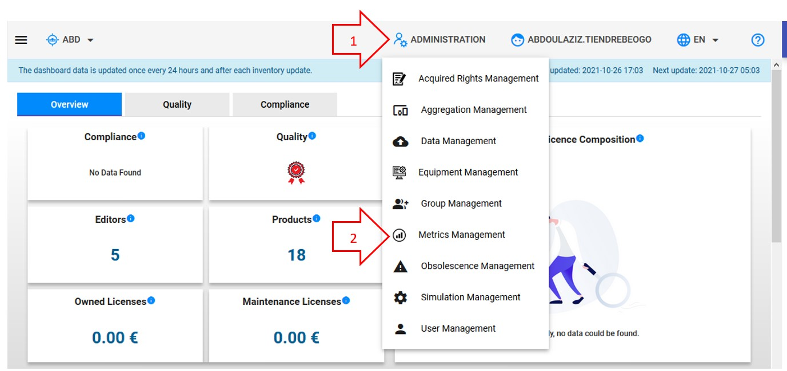
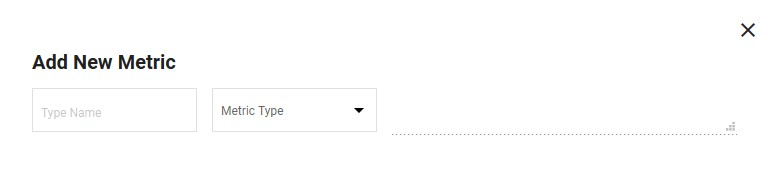
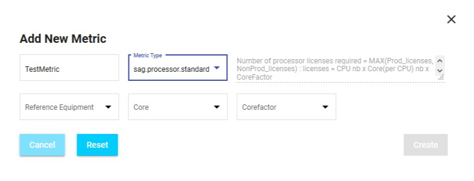

<link rel="stylesheet" href="../../../css/enlargeImage.css" />

# Metrics management

First, make sure that you are an admin and that you are working on the good scope :

{: .zoom}

## What is a metric ?

A metric is a unit of measurement used to count the number of licenses necessary for a given use for a given product.

## Access

You can access to "Metrics management" by clicking here :

{: .zoom}

## Possibilities

You can do 3 things from there :  
- Add a new metric ([here](#add-a-new-metric))  
- See the details of an existing metric ([here](#see-the-details-of-an-existing-metric))  
- Delete an existing metric([here](#delete-an-existing-metric))  
- Edit and existing metric([here](#Edit-an-existing-metric))  

{: .zoom}

## Add a new metric

You have to click on Add Metric :

{: .zoom}

This window will be shown :

{: .zoom}

You can see these different fields :  
- "Type Name" : Write the name of your choice for your new metric (**It must be the same name as in your acquired rights**)    
- "Metric Type" : Choose the type of your new metric  

When you choose the "Metric Type", the window changes depending on which "Metric Type" has been chosen. For example, if I choose "sag.processor.standard" : 

{: .zoom}

The field on the top right is completed with the formula of the metric and I have new fields to fill in according to the metric that I chose.
Here is an example with the fields to complete for the "sag.processor.standard" metric :  
- Reference Equipment : One of the equipment type  
- Core : The attribute of the equipment that references the number of cores  
- Corefactor : The attribute of the equipment that references the "corefactor"  

Once you have completed all the fields, you have to click on "Create" to create your new metric !

Notice that, if a metric type already exists, you con create another one of the same type with a different name.

## See the details of an existing metric 

By clicking anywhere on the line of a metric in the list, the details of the metric will be displayed like this :

{: .zoom}

You can see on this screen :  
- Metric Name : The name of the metric  
- Metric Type : The type of the metric  
- Metric Description : The formula used to calculate the metric  
- Other attributes : All of the other attributes are changing depending on the metric type, they are used to obtain the values of the formula (e.g : "Core" represents "Core(perCPU) nb" in the formula, "CPU" represents "CPU nb" in the formula). All of these attributes are equipment attributes

## Delete an existing metric

You have to click on the little trash icon next to the metric that you want to delete as shown below.

{: .zoom}

After clicking on the trash icon, the frame below will be shown. If you are sure to delete the metric click on "OK" 

{: .zoom}

## Edit an existing metric

You have to click on the little pencil icon next to the metric that you want to edit as shown below.

{: .zoom}

After clicking on the pencil icon, the frame below will be shown. 

{: .zoom}

You will be allowed to edit all parameters except the metric name and type.

Once the changes done, click on update to save the news parameters.

