<link rel="stylesheet" href="../../../css/enlargeImage.css" />

# Nominative users

## What are the nominative users?

In the Saas,unlike to the on premise, the licensing mode is based on the number of usage of the product. The usage is most of time registered as a number of users over a period of time, but it can also be based on the storage used, the profile of the users, ...

The nominative user is a user dedicated to a product or an aggregation of product

## Access

You can access to "Nominative users" by clicking here :

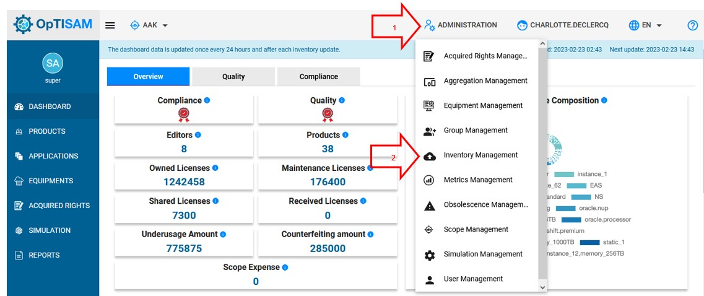{: .zoom}

This page will be displayed:

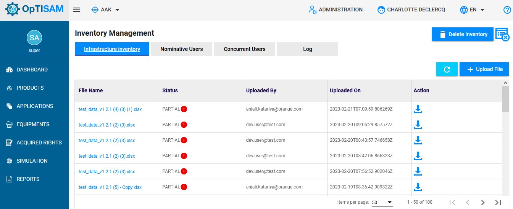{: .zoom}

Then click on "Nominative Users", to access to nominative users section

## Possibilities

From there, you have many possibilities :

- Add a new nominative user ([here](#add-a-new-nominative-user))  
- Edit an existing nominative user ([here](#edit-an-existing-nominative-user))  
- Delete an existing nominative user ([here](#delete-an-existing-nominative-user))  
- Get a report of nominative users ([here](#get-a-report-of-nominative-users)) 

## Add a new nominative user 

First make sure that you are an admin and in nominative users section :

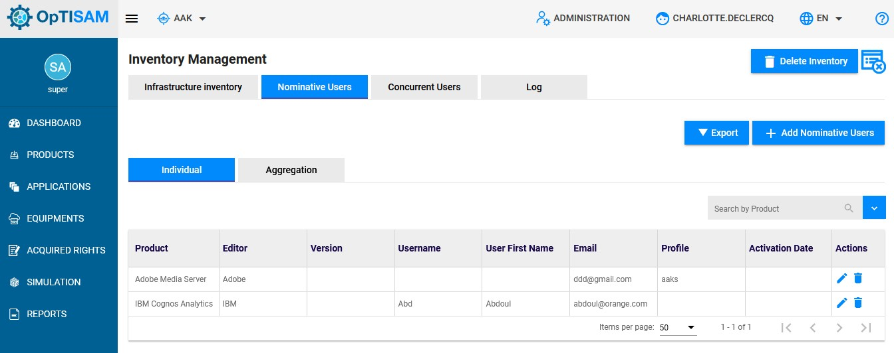{: .zoom}

To add a new nominative user, you have to click on " Add Nominative Users":

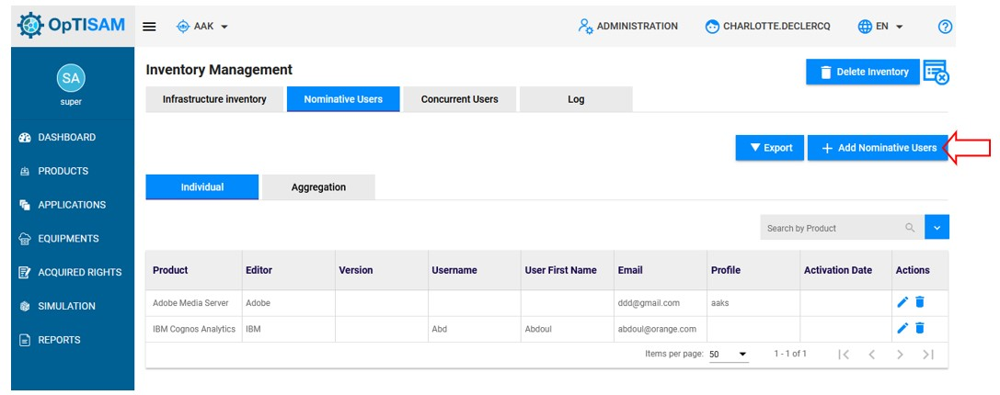{: .zoom}

This page will be displayed : 

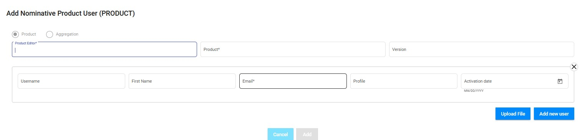{: .zoom}

You will have to fill the different fields as on the page below:

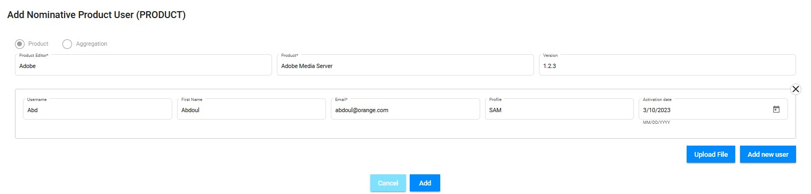{: .zoom}

Once done, click on "Add" to add the nominative user.

Notice that you can add nominative users through a CSV file. Just click on "Upload file" and add the file containing the different as displayed below:

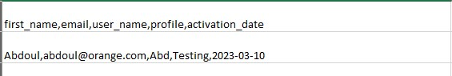{: .zoom}

You will have to provide :
The first name, email, username, profile and the activation date. 

You can download the tamplate [Here](../../excel/nominativeTemplate.csv) 

Notice that this example is for a single product, but it can be used for aggregation by using "Aggregation" section. 

## Edit an existing nominative user

To edit an existing nominative user, click on the pencil icon located on the same line of the nominative user to edit

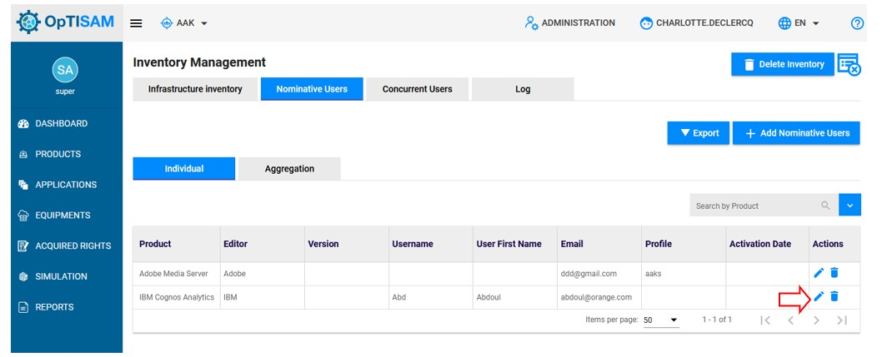{: .zoom}

A page containing the nominative user information will be displayed

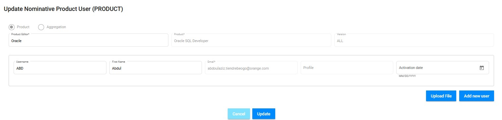{: .zoom}

You can edit only the "Product Editor", the "Username", the "First name" and the "Activation date".

Once done, click on "Update" to save your changes. 

Notice that this action is applicable for aggregations. 

## Delete an existing nominative user

To delete an exiting nominative user, click on the trash icon located on the same line of the nominative user to delete. 

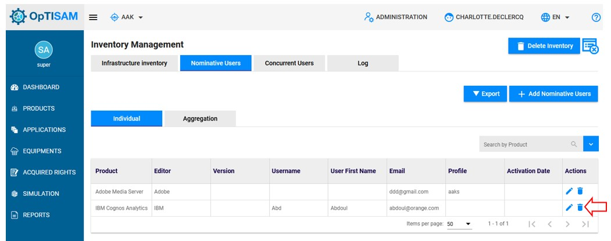{: .zoom}

This pop up will be displayed:

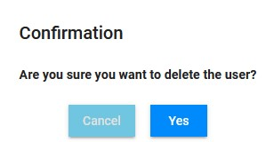{: .zoom}

Click on "Yes" to confirm your deletion. 

Notice that this action is applicable for aggregations. 

## Get a report of nominative users

To get a repport of nominative users, click on "Export"

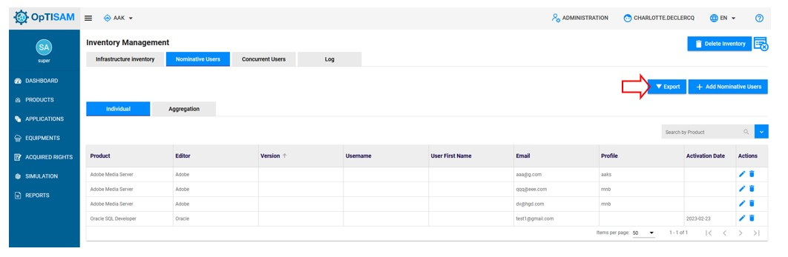{: .zoom}

A file will be downloaded.

Notice that this action is applicable for aggregations. 

