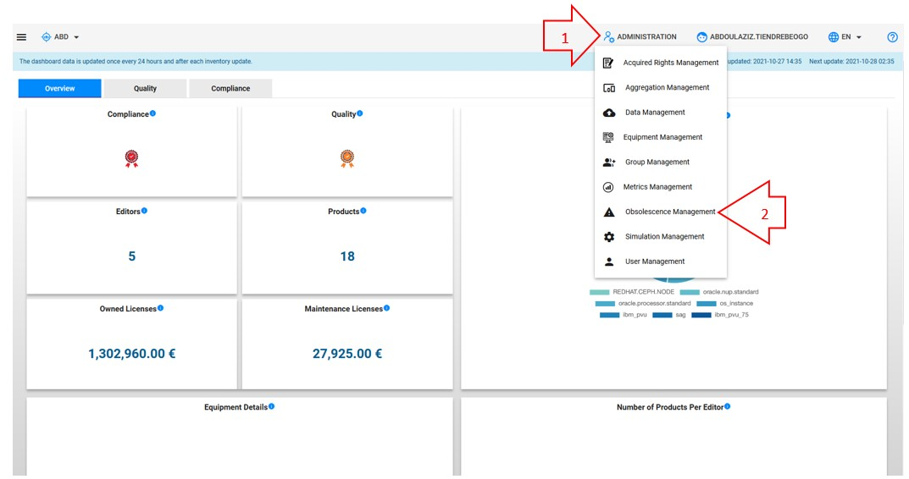
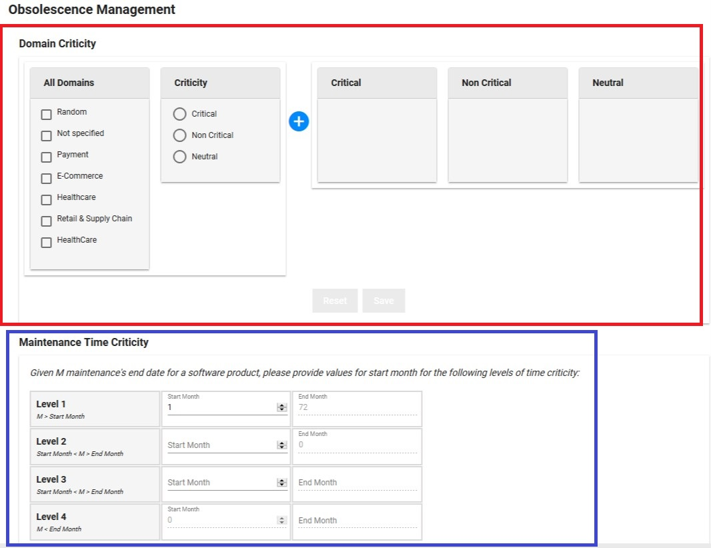
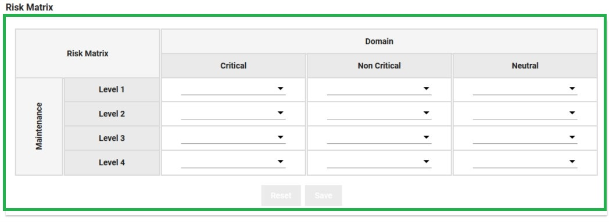
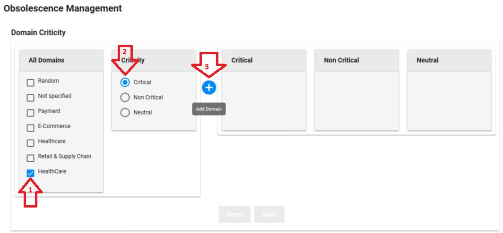
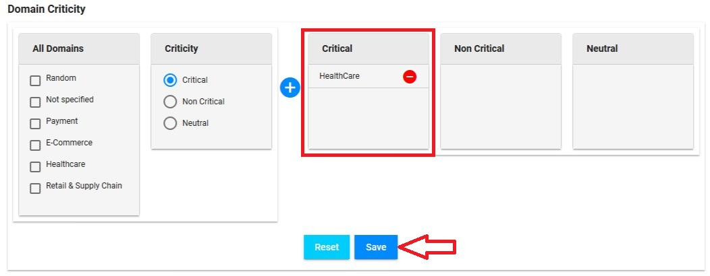
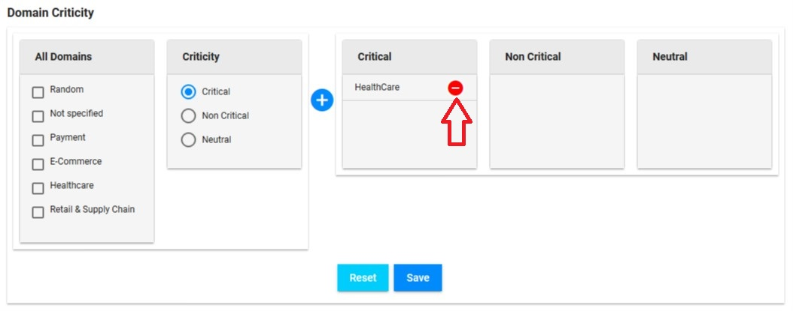
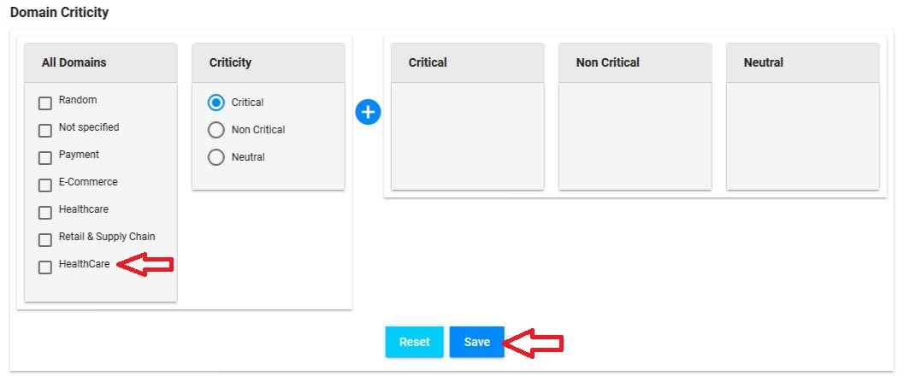
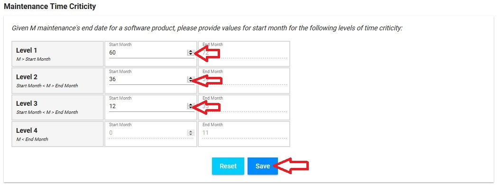
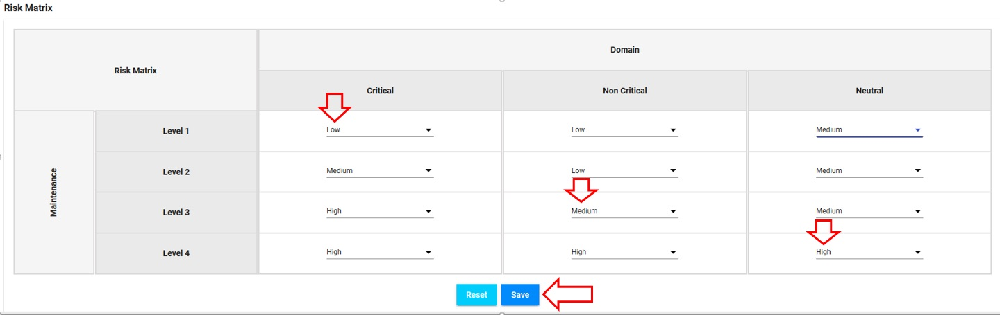

<link rel="stylesheet" href="../../../css/enlargeImage.css" />

First, make sure that you are an admin and that you are working on the good scope :

{: .zoom}

## What is the obsolescence ?

The risk of obsolescence corresponds, for a metric, to the impact rate on a scope if a product's license expires.

## Access

You can access to "Obsolescence management" by clicking here :

{: .zoom}

## Possibilities

You can do 3 things from here :  
- Add or delete a domain criticity ([here](#add-or-delete-a-domain-criticity))  
- Change the time limits of criticity levels ([here](#change-the-time-limits-of-criticity-levels))  
- Change the risk matrix ([here](#change-the-risk-matrix))  

{: .zoom}
{: .zoom}

## Add or delete a domain criticity

### Add a domain criticity

1. Select the application domain 
2. Select the criticity you want to apply to it 
3. Click on the + symbol to create it  

{: .zoom}

Once, it's done, the domain will be shown in the criticity column selected, you can click on "Save" to save the changes :  

{: .zoom}

### Delete a domain criticity

Click on the red symbol on the left of the domain criticity you want to delete :  

{: .zoom}

The domain will go back in the first list, you can click on "Save" to save the changes :  

{: .zoom}

## Change the time limits of criticity levels

Here, you can change the time limits for levels (1 is the less critical, 4 is the most critical) of criticity, e.g on the screenshot below :  
- Level 1 : The license expires between 60 and 72 months from today  
- Level 2 : The license expires between 36 and 59 months from today  
- Level 3 : The license expires between 12 and 35 months from today  
- Level 4 : The license expires between 0 and 11 months from today   

{: .zoom}

You can change the values in the table.  
Once it's done, you can click on "Save" to save the current values.

## Change the risk matrix

You can choose in each cell what is the level of risk (High, Medium, Low) for each combination :  

{: .zoom}

For example, in this screenshot, you can see that :  
- An app in a "Critical" domain that has a product with a time limit criticity of "Level 1" : "High" risk  
- An app in a "Non Critical" domain that has a product with a time limit criticity of "Level 2" : "Medium" risk  
- An app in a "Neutral" domain that has a product with a time limit criticity of "Level 3" : "Low" risk  

Once, it's done, you can save the changes by clicking on "Save" button.

## Results

You will be able to see the results of all the changes you've done on the "Obsolescence Management" page in the "Obsolescence Risk" column in the "Applications" table [here](../../exploring/parkInventory/applications).

