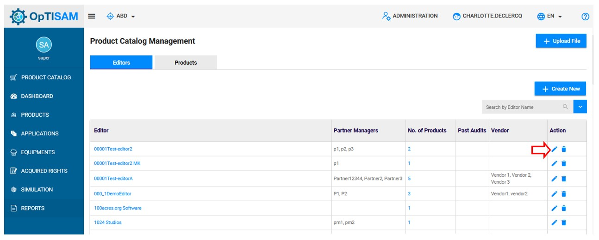

<link rel="stylesheet" href="../../../css/enlargeImage.css" />

# Product catalog management

First, make sure that you are an admin and that you are working on the good scope :

{: .zoom}

## Access

You can access to "Product catalog management" by clicking here :

{: .zoom}

## Presentation

The presentation table is : 

{: .zoom}

You can see:

- Editor : The name of the editor
- Partner Managers : The list of partner Managers
- No. of products: The number of products
- Past Audits : The date of the last audits
- Vendor : The vendors of the product
- Action : The differents possible actions that you can do on a line (edit/delete)

## Possibilities

You can do 6 things from there :  

- Add a new editor in the catalog ([here](#add-a-new-editor))  
- Edit an existing editor in the catalog ([here](#edit-an-existing-editor))  
- Delete an existing editor in the catalog ([here](#delete-an-existing-editor))   
- Add a new product to the catalog ([here](#add-a-new-product))  
- Edit an existing product in the catalog ([here](#edit-an-existing-product))  
- Delete an existing product in the catalog ([here](#delete-an-existing-product))  

 

## Add a new editor

First make sure that you are in editors section:

{: .zoom}

To add a new editor, you have to click on "Create New" : 

{: .zoom}

This page will be displayed : 

{: .zoom}

You have to fill all the fields to add the new editor

Notice that only the name is mandatory

Once done, click on "Submit" to add the new editor. 

## Edit an existing editor

To edit an existing editor, click on the pencil icon located on the same line of the editor to edit

{: .zoom}

A page containing the editor information will be displayed

{: .zoom}

You can edit all the fields. Once done, click on "Update" to save your changes. 

## Delete an existing editor

To delete an existing editor, click on the trash icon located on the same line of the editor to delete. 

{: .zoom}

This pop up will be displayed:

{: .zoom}

Click on "OK" to confirm your deletion. 

Notice that delete an editor from the product catalog doesn't remove it from the inventory in OpTISAM

## Add a new product 

First make sure that you are in products section:

{: .zoom}

To add a new editor, you have to click on "Create New" : 

{: .zoom}

This page will be displayed :

{: .zoom}

You have to fill the different fields to add a new product

Notice that only the product name and editor are mandatory

Once done, click on "Create" to add the product to the catalog.

## Edit an existing product

To edit an existing product, click on the pencil icon located on the same line of the product to edit

{: .zoom}

A page containing the product information will be displayed

{: .zoom}

You can edit all the fields. Once done, click on "Update" to save your changes.

## Delete an existing Product

To delete an existing product, click on the trash icon located on the same line of the product to delete. 

{: .zoom}

This pop up will be displayed:

{: .zoom}

Click on "OK" to confirm your deletion. 

Notice that delete a product from the product catalog doesn't remove it from the inventory in OpTISAM

