<link rel="stylesheet" href="../../../css/enlargeImage.css" />

# Raw data upload

First, make sure that you are an admin and that you are working on the good scope :

{: .zoom}

**You can click [here](#access-to-the-page) if you already have your files completed.**

**You can go [here](../dataManagement) if you want to delete the inventory.**

You can also directly upload your data one by one, with the different files used by OpTISAM.  
This means you have to create a file for each type of data and some files in order to link the data together.

## Example of raw data generic template

[Here](../../excel/rawDataEmpty.zip), you can find an example zip file of the raw data template without data.  
[Here](../../excel/rawData.zip), you can find an example zip file of a completed raw data template.  

In this example, you will find : 

7 files about the applications, the products and the acquired rights :  
- applications.csv : [here](#applications)  
- applications_instances.csv : [here](#applications_instances)  
- applications_products.csv : [here](#applications_products)  
- instances_equipments.csv : [here](#instances_equipments)  
- instances_products.csv : [here](#instances_products)  
- products_equipments.csv : [here](#products_equipments)  
- product_acquiredRights.csv : [here](#product_acquiredRights)   
- products.csv : [here](#products)  

1 file for each equipment type (equipment_[equipmentTypeName].csv), for example :  
- equipment_vcenter.csv : [here](#equipment_vcenter)  
- equipment_cluster.csv : [here](#equipment_cluster)  
- equipment_server.csv : [here](#equipment_server)  
- equipment_partitions.csv : [here](#equipment_partition)  

**In each file, there is a "flag" column at the end of the file. This value can be either 0 or 1.  
Basically, it will be 1 if you want 1 to add the data present in your line, 0 if you want to delete it from OpTISAM.  
But for now it is impossible to put "0" value in flag, because a data can't be deleted unitarily.**

### Applications

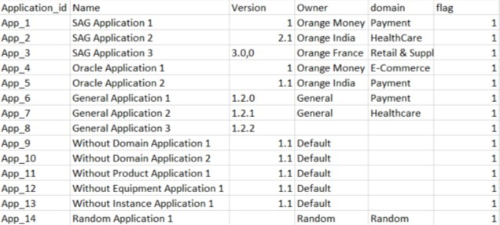{: .zoom}

In this file, you will find the applications data and these attributes :  
- Application_id : The id of the application  
- Name : The name of the application  
- Version : The version of the application  
- Owner : The owner of the application  
- domain : The domain of the application  

### Applications_instances

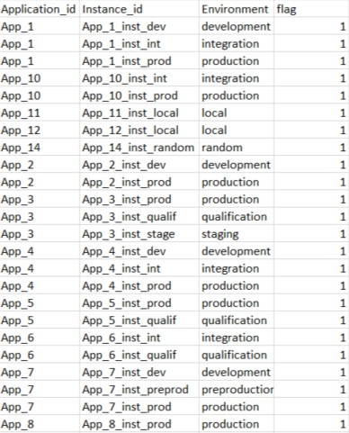{: .zoom}

In this file, you will find the linking between applications and instances and these attributes :  
- Application_id : The id of the application  
- Instance_id : The id of the instance  
- Environment : The environment of the instance  

### Applications_products

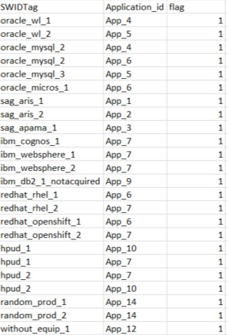{: .zoom}

In this file, you will find the linking between applications and products and these attributes :  
- SWIDTag : The swidtag of the product  
- Application_id : The id of the application  

### Instances_equipments

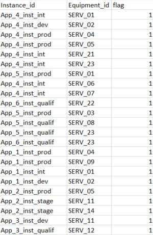{: .zoom}

In this file, you will find the linking between instances and equipments and these attributes :  
- Instance_id : The id of the instance  
- Equipment_id : The id of the equipment  

### Instances_products

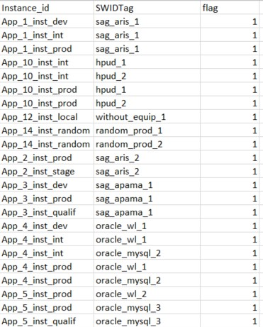{: .zoom}

In this file, you will find the linking between instances and products and these attributes :  
- Instance_id : The id of the instance  
- SWIDTag : The swidtag of the product  

### Products_equipments

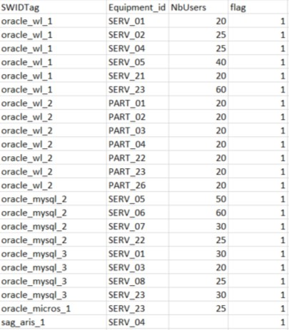{: .zoom}

This file is used to declare for each equipment the list of products that are installed on it :  
- SWIDTag : The swidtag of the product  
- Equipment_id : The id of the equipment  
- NbUsers : The number of users using the product on the equipment  

### Product_acquiredRights

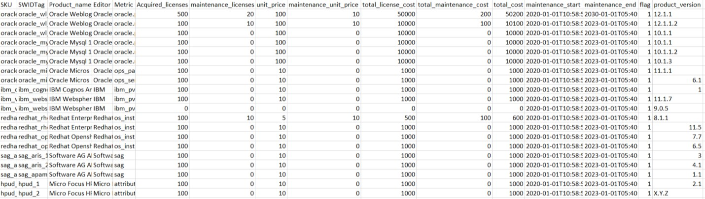{: .zoom}

In this file, you will find the all the acquired rights data, the acquired rights and products linking and these attributes :  
- SKU : The id of the acquired right
- SWIDTag : The swidtag of the product  
- Product_name : The name of the product  
- Editor : The editor of the product  
- Metric : The metric used to compute the product  
- Acquired_licenses : The number of acquired licenses for the product  
- maintenance_licenses : The number of acquired maintenance licenses for the product  
- unit_price : The unit price of the acquired licenses for the product  
- maintenance_unit_price : The unit price of the acquired maintenance licenses for the product  
- total_license_cost : The total cost of the acquired licenses for the product  
- total_maintenance_cost : The total cost of the acquired maintenance licenses for the product  
- total_cost : The total cost for the product  
- maintenance_start : The date when the maintenance starts  
- maintenance_end : The date when the maintenance ends  
- product_version : The version of the product  

### Products

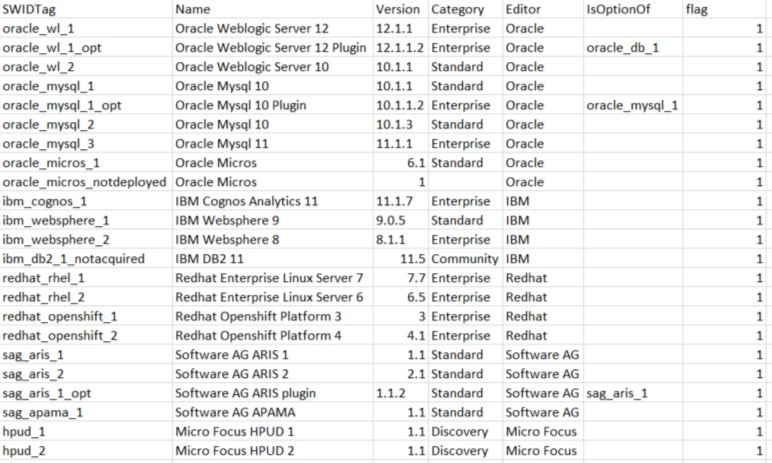{: .zoom}

In this file, you will find the products data and these attributes :  
- SWIDTag : The swidtag of the product  
- Name : The name of the product  
- Version : The version of the product  
- Category : The category of the product  
- Editor : The editor of the product  
- IsOptionOf : If this product is an option of another one, this is the SWIDTag of the product that this product is an option of  

### Equipment_vcenter

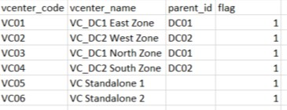{: .zoom}

In this file, you will find the vcenter data and these attributes :  
- vcenter_code : The id of the vcenter  
- vcenter_name : The name of the vcenter  
- parent_id : The id of the parent datacenter (if there is one)  

### Equipment_cluster

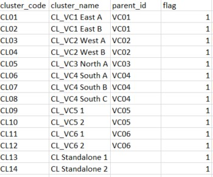{: .zoom}

In this file, you will find the cluster data and these attributes :  
- cluster_code : The id of the cluster  
- cluster_name : The name of the cluster  
- parent_id : The id of the parent vcenter (if there is one)  

### Equipment_server

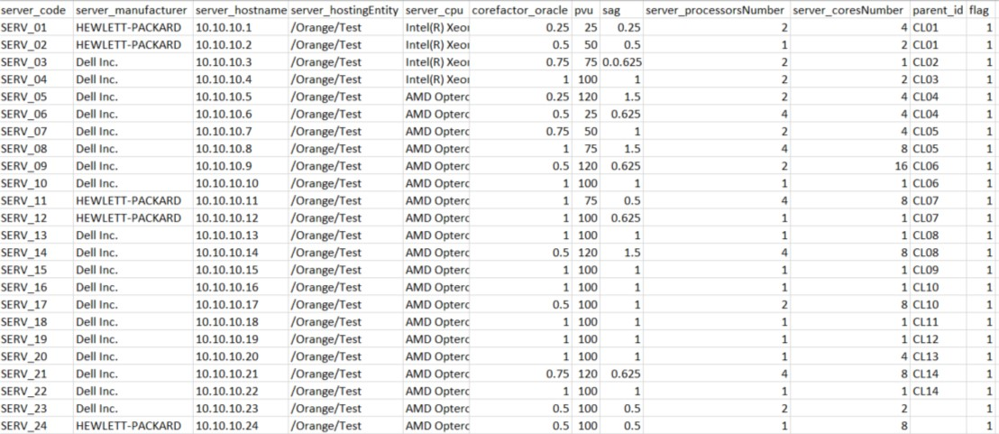{: .zoom}

In this file, you will find the server data and these attributes :  
- server_code : The id of the server  
- server_manufacturer : The manufacturer of the server  
- server_hostname : The hostname of the server  
- server_hostingEntity : The entity hosting the server  
- server_cpu : The cup model of the server  
- corefactor_oracle : The corefactor corresponding to the cpu of the server  
- pvu : The Processor Value Unit of the cpu of the server  
- sag : The sag factor required for the computation of a metric  
- server_processorsNumber : The number of processors of the cpu of the server  
- server_coresNumber : The number of cores of the cpu of the server  
- parent_id : The id of the parent cluster (if there is one)  

### Equipment_partition

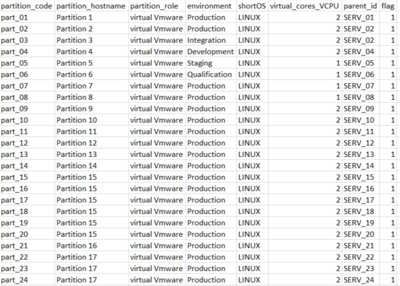{: .zoom}

In this file, you will find the partition data and these attributes :  
- partition_code : The id of the partition  
- partition_hostname : The hostname of the partition  
- partition_role : The role of the partition  
- environment : The environment of the partition  
- shortOS : The OS of the partition  
- virtual_cores_VCPU : The virtual cores of the partition  
- parent_id : The id of the parent server (if there is one)  

## Access to the page

1. Click on "Administration"
2. Click on "Data Management" 
3. Click on "Global Data" 

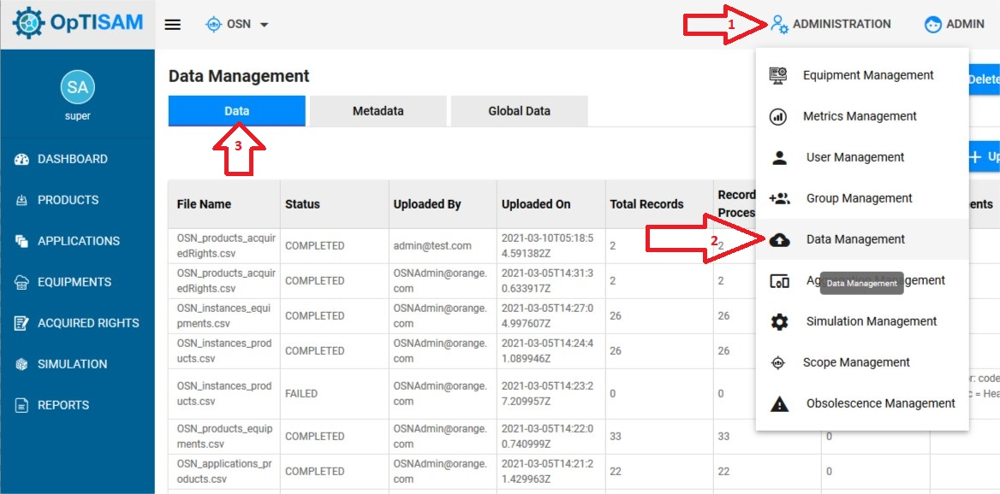{: .zoom}

## Upload the file

Click on "Upload File" : 

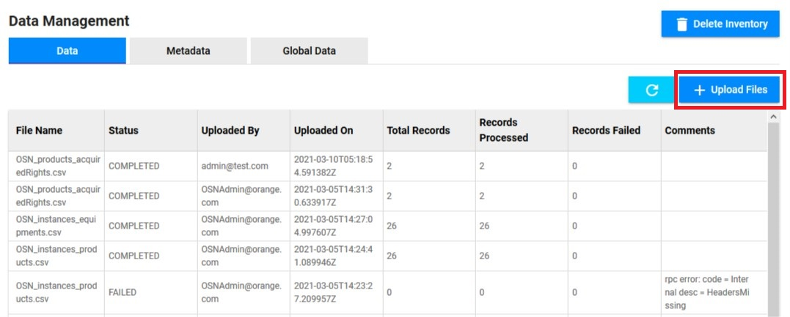{: .zoom}

1. Click on "Browse" to select the file that you want to upload
2. Click on "Submit"

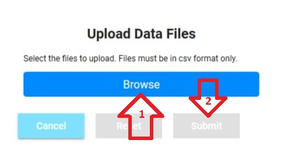{: .zoom}

Be careful, if a deletion or an injection is already running, an error message will be shown, and you will not be able to import your data.

Once the file are uploaded, you will see them in the table below : 

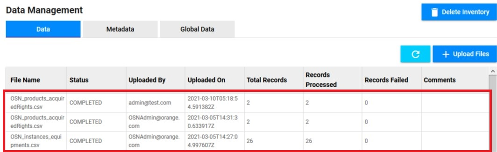{: .zoom}

In this table, you will be able to see how many records have been successfuly imported.  

You have to import all the files in order to have a complete inventory with all the links.  

