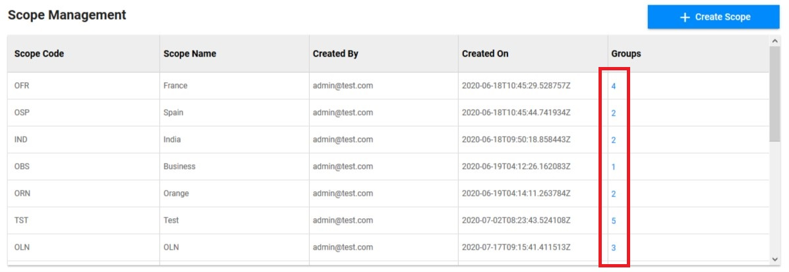
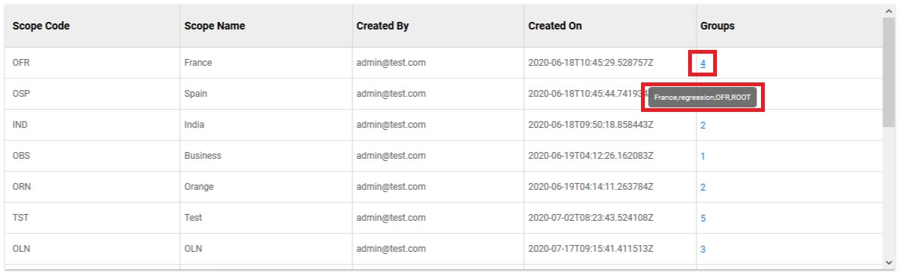
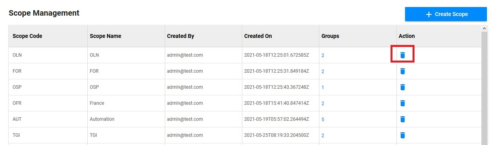

<link rel="stylesheet" href="../../../css/enlargeImage.css" />

# Scope management

First, make sure that you are a super admin

**Most of the users will only have one scope to work on.**

## What is a scope ?

Scopes are used to identify different customers of OpTISAM. It provides a way to isolate data from different customers. Currently isolation is only at application layer, but same can be extended to Database layer if required(sharding/partitioning etc). We will stick to 3 letter codes for scope.  
Scope Naming Conventions :  
- For countries : O + 2 digit country ISO code eg. OFR, OSP etc  
- For Business Units : OCB, TGI  

OpTISAM is based on scopes and require user to provide scope while creating the types of those modules.  
Each customer entity of OpTISAM will have its scope.

## Access

You can access to "Scope Management" by clicking here :

{: .zoom}

## Presentation

The presentation table is : 

{: .zoom}

You can see :  
- Scope code : The code of the scope. You will see it in the selection tab of the scope (top left)  
- Scope name : The name of the scope  
- Created by : The mail adress of the creator of the scope  
- Created on : The date of the creation of the scope  
- Groups : The number of groups inside of the scope  

## Possibilities

You can do 3 things from there :  
- Create a new scope ([here](#create-a-new-scope))  
- Check the groups of an existing scope ([here](#check-the-groups-of-an-existing-scope))  
- Delete an existing scope ([here](#delete-an-existing-scope))  

{: .zoom}

## Create a new scope

Click on "Create scope" : 

{: .zoom}

This screen will be shown : 

{: .zoom}

You just have to fill in these 2 fields and choose the kind of scope the you want:  
- Scope ID : The ID of the scope you want to create  
- Scope Name : The name of the scope you want to create  
- Check Generic Template : if you are gonna upload your inventory with an excel file. 
- Check Specific Template : if you are not using excel files for the inventory. 

Once, you have filled in these 2 fields and choose the kind of scope, you have to click on "Create" to create the new scope !

## Check the groups of an existing scope

Place your mouse on the number in the column "Groups" of the scope you want to check :

{: .zoom}

You will see this small list : 

{: .zoom}

This list is the list of groups in the scope.

## Delete an existing scope

Click on the small trash icon on the line of the scope that you want to delete :  

{: .zoom}

You will see this screen : 

{: .zoom}

You have to click on "OK" if you want to delete the scope or on "Cancel" if you don't want to.  

