<link rel="stylesheet" href="../../../css/enlargeImage.css" />

First, make sure that you are an admin and that you are working on the good scope :

{: .zoom}

## What is a simulation ?

The simulations in OpTISAM are used to simulate a change in the inventory park or in the licensing of the products.

## Access

You can access to "Simulation management" by clicking here :

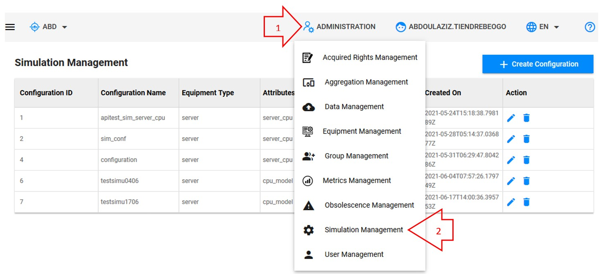{: .zoom}

## Presentation

The presentation table is :

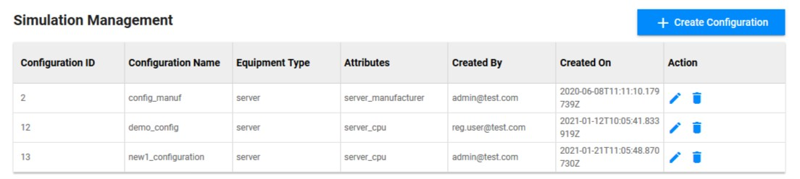{: .zoom}

You can see :  
- Configuration ID : The ID of the simulation's configuration   
- Configuration Name : The name of the simulation's configuration  
- Equipment Type : The equipment type on which the simulation will be done  
- Attributes : The main attribute that will be modified for the simulation  
- Created On : Date of the creation of the simulation's configuration  

## Possibilities

You can do 3 things from here :  
- Create a new configuration ([here](#create-a-new-configuration)) : to create a hardware simulation (on an equipment)  
- Edit an exisiting configuration ([here](#edit-an-existing-configuration))  
- Delete an exisiting configuration ([here](#delete-an-existing-configuration))  

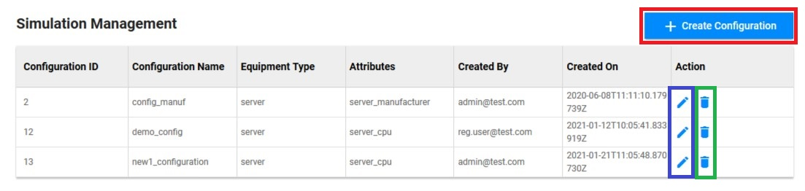{: .zoom}

## Create a new configuration

Click on "Create Configuration" :

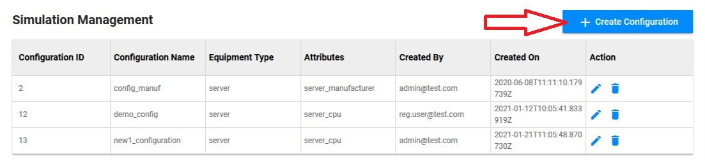{: .zoom}

This screen will be shown :  

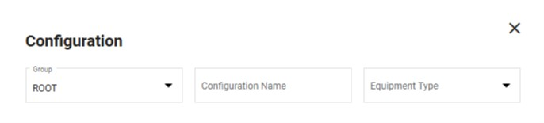{: .zoom}

You have 3 fields to fill in :  
- Group : Must stay "ROOT"  
- Configuration Name : Choose the name that you want to give to your configuration  
- Equipment Type : Select the equipment type on which you want to create a simulation's configuration  

Once, you've filled in the fields, a new window will be shown :  

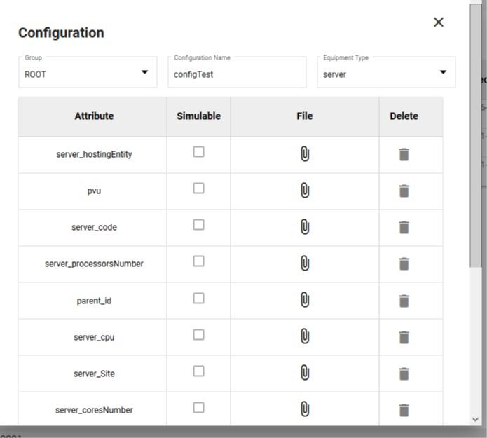{: .zoom}

In this window, you will be able to select the attribute on which you want to do a simulation and join a CSV file corresponding to this attribute. 

Let's take an example with the "server_cpu", you will have to create a CSV file with new values corresponding to all the new values of "core_cpu" as below :  

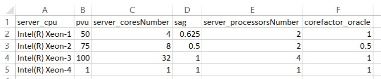{: .zoom}

As you can see, we have 4 different values of the "server_cpu" with different attributes associated to these values.  
So, in the simulation, if you select Intel(R) Xeon-1, it will simulate with :  
- pvu = 50  
- server_coresNumber = 4  
- sag = 0.625  
- server_processorsNumber = 2  
- corefactor_oracle = 1  

You can find a file filled in [here](../../excel/simu.csv)  

Once, the file is created, you have to click on the paper click next to the attribute you want to edit :  

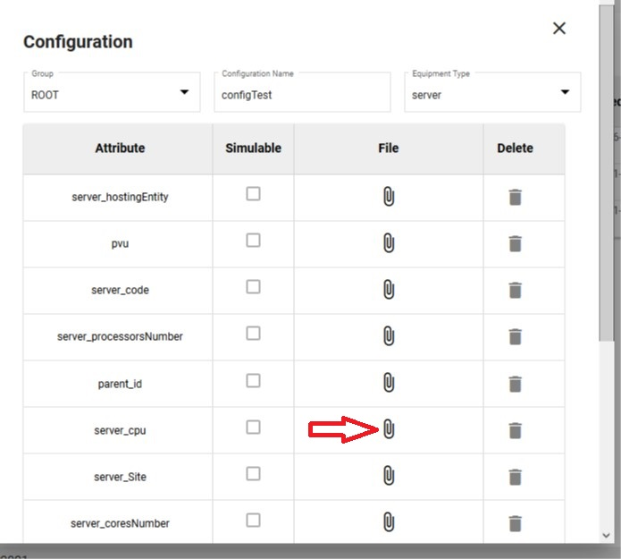{: .zoom}

Then select the CSV file you've just created :  

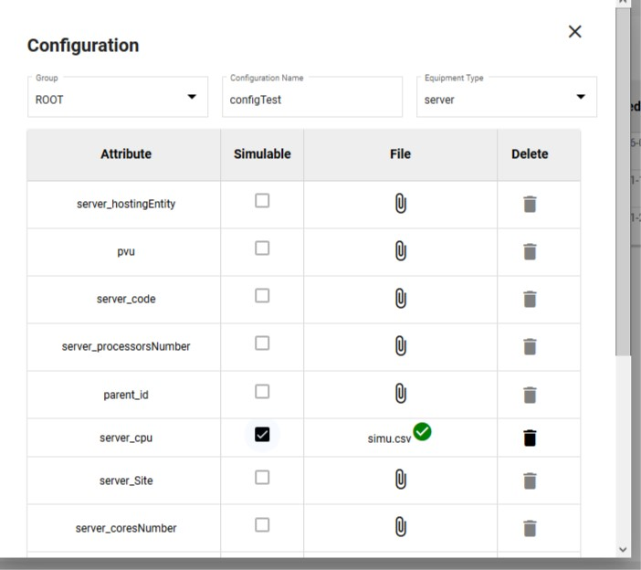{: .zoom}

You can click on the small trash on the right if you've made a mistake in order to delete the file :  

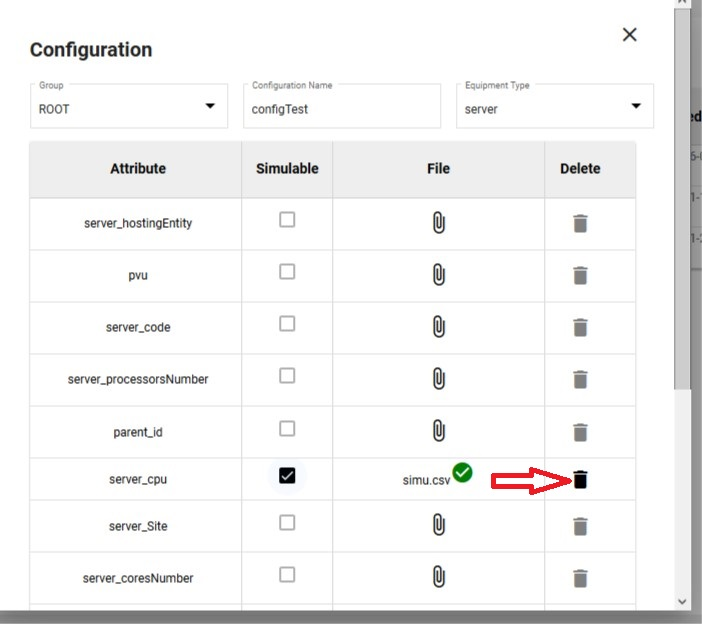{: .zoom}

Once you've uploaded the right file for the right attribute, just scroll and click on "Apply" in order to create the new simulation's configuration.

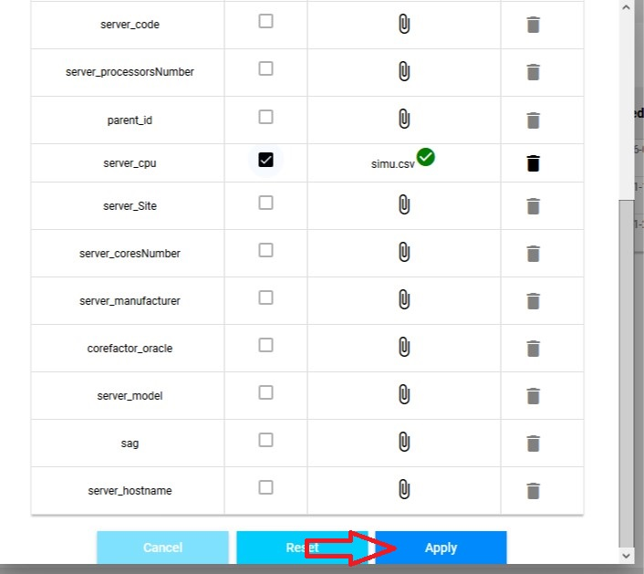{: .zoom}

## Edit an exisiting configuration

Click on the small pencil in the line of the simulation's configuration you want to edit : 

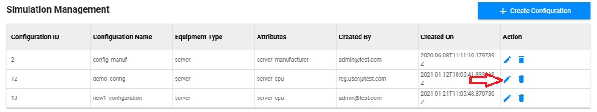{: .zoom}

This screen will be shown :  

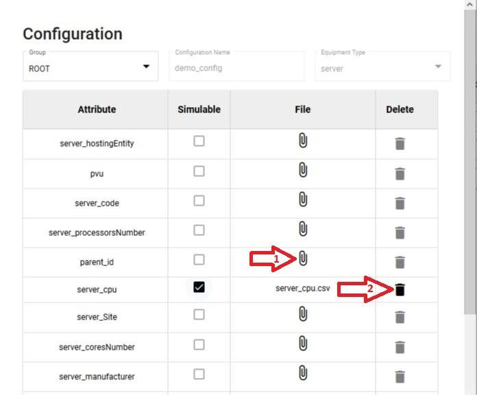{: .zoom}

From here, you can :  
1. Add a new file to modify an attribute in the simulation as explained in [Create a new configuration](#create-a-new-configuration)  
2. Delete a file already added to the simulation's configuration by clicking on the trash  

Once, it's done, you have to click on "Update" to edit the simulation's configuration.

## Delete an exisiting configuration

Click on the small trash in the line of the simulation's configuration you want to delete :  

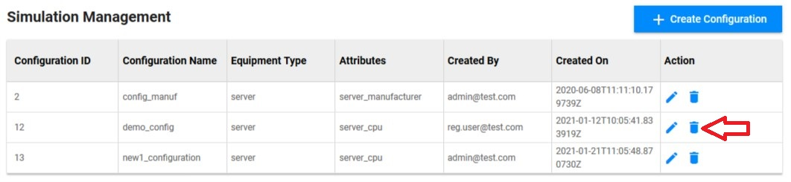{: .zoom}

This screen will be shown :  

{: .zoom}

Click on OK in order to delete the simulation's configuration.

