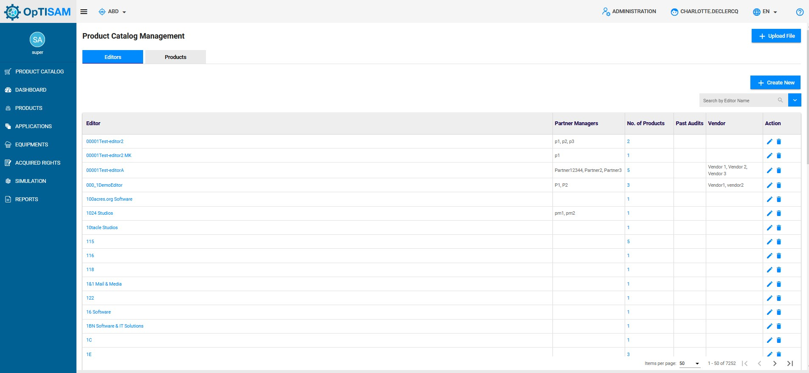

## Access

You can access to "Product catalog management" by clicking here :

{: .zoom}

## Presentation

The presentation table is : 

{: .zoom}

To add a new product catalog, you have to click on "Upload File"

{: .zoom}

This window will be shown:

{: .zoom}

Then you have to click on "Browse" as shown below:

{: .zoom}

From there you have to choose your file to upload then click on "Submit" to add your file.