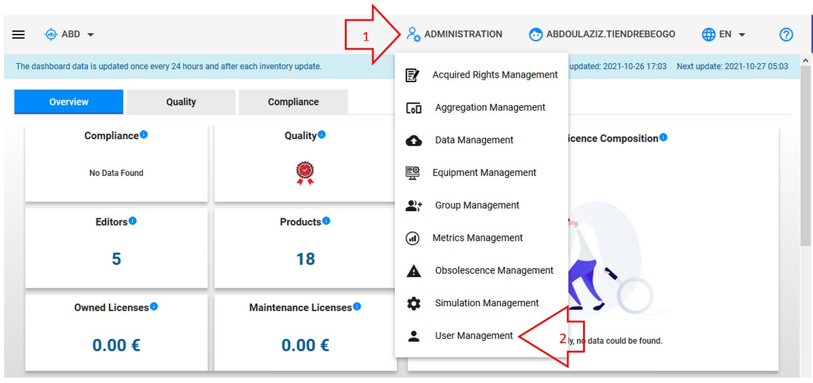
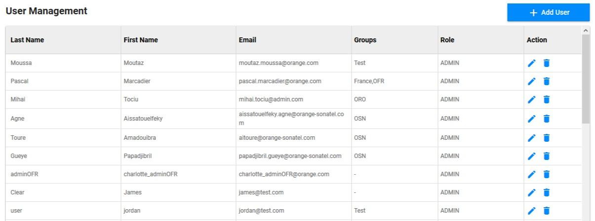
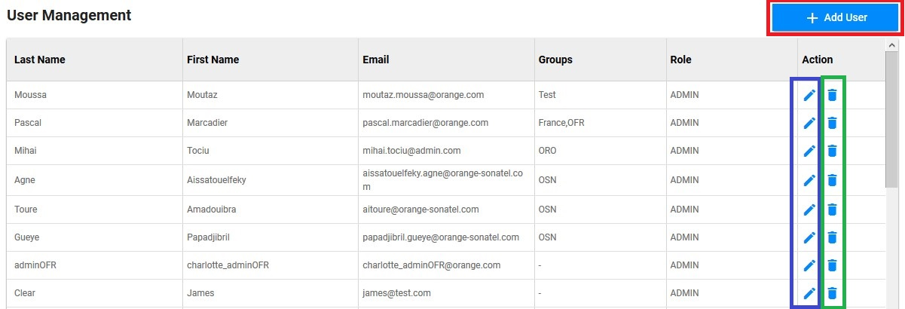
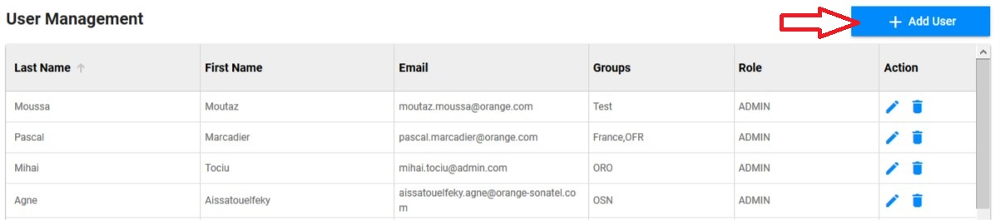
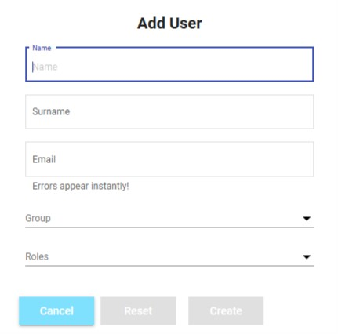
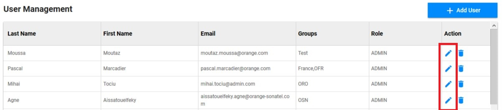
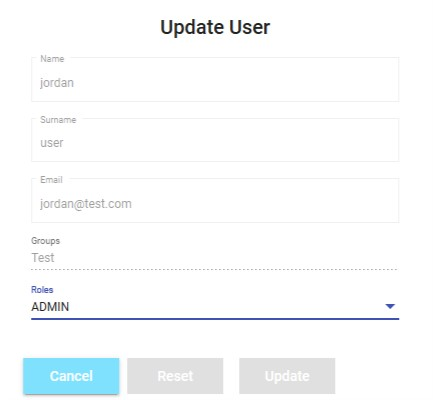
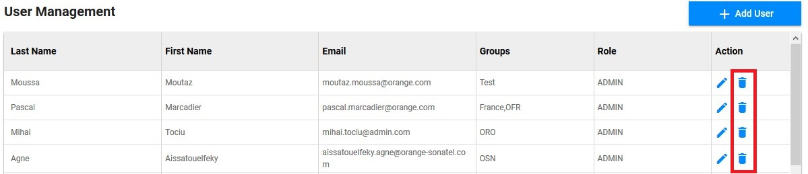
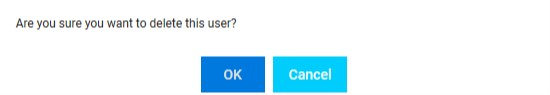

<link rel="stylesheet" href="../../../css/enlargeImage.css" />

# Users management

First, make sure that you are an admin

## What is a user ?

User is anybody who can access/use OpTISAM application. User can be human or api consumers. Each user has a role and a set of groups to which he belongs.

## Access

You can access to "Users Management" by clicking here :

{: .zoom}

## Presentation

The presentation table is : 

{: .zoom}

You can see :  
- Last Name : The last name of the user  
- First Name : The first name of the user  
- Email : The email of the user  
- Groups : The groups to which the user belongs  
- Role : The role of the user (USER or ADMIN)  

## Possibilities

You can do 3 things from there :  
- Add a new user ([here](#add-a-new-user))  
- Edit an existing user ([here](#edit-an-existing-user))  
- Delete an existing user ([here](#delete-an-existing-user))  

{: .zoom}

## Add a new user

You have to click on "Add User" : 

{: .zoom}

This screen will be shown : 

{: .zoom}

You will have to fill in all these fields :  
- Name : The first name of the user  
- Surname : The last name of the user  
- Email : The email of the user  
- Group : Select the group(s) to which the user will belong  
- Role : Select the role of the user  

Once, you have filled in all the fields, you have to click on "Create" to create the new user.  
The default password is "password" when you create a new user.  
You will have to tell the user that his account has been created as no e-mail will be sent to notify him.

## Edit an existing user

You have to click on the pen in the line of the user you want to edit : 

{: .zoom}

This screen will be shown : 

{: .zoom}

You will be able to edit the role of the user, either "ADMIN" or "USER". Then you have to click on "Update" to edit the user.

## Delete an existing user

You have to click on the trash in the line of the user you want to edit : 

{: .zoom}

This window will be shown : 

{: .zoom}

You just have to click on "OK" to delete the user.

