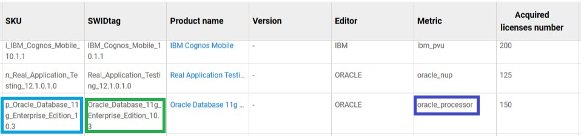
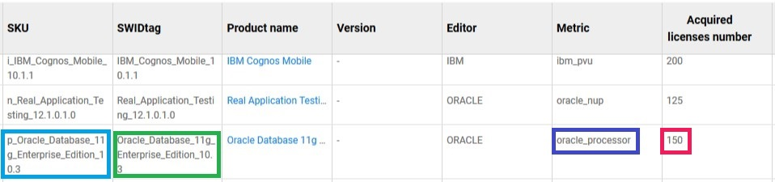

<link rel="stylesheet" href="../../../css/enlargeImage.css" />

# How is OpTISAM computing compliance ?

OpTISAM uses the information you'll provide to compute the compliance.  
For OpTISAM, each product version is identified by a SWIDTag.   
For this SWIDTag, you have acquired licenses. The contract you passed with the software provider is materialized by a SKU (Stock Keeping Unit).  
A SKU in OpTISAM refers to a specific package you bought. For that package, you negociated the metrics, the price of the license and even the maintenance.  
OpTISAM needs to know for each product, the list of SKUs and the specificities related to those SKUs (metrics, prices, maintenance, number of licenses acquired...).  

## Acquired rights

An acquired right is something that defines how much licenses you have aquired for a **product/metric pair**. It is identified by a **SKU**.

{: .zoom}

### SKU

The SKU is the identifier of the acquired right. Each product has one or more **SKU** associated. This **SKU** is associated to the **SWIDTag** of a product, to a **metric** and to a **number of licenses acquired**. 

{: .zoom}

## Metrics

OpTISAM has predefined metrics and allows you to customize metrics for your products.  
Each acquired right has its own metric which can be a standard one : "count the number of instances installed on a server", or a specific one, like the Oracle processor metric. This metric will be used to compute the compliance.  

Let's take an example : **the formal definition of "processor metric" from Oracle**.  

### Oracle - Processor metric (Formal definition)

In order to compute the compliance with this metric, you have to know the **number of processors** (each chip if this is a multi-chip processor) of the equipment on which the Oracle program is running. When you know this number you will have to multiply it by the **core factor** (a number defined by Oracle) associated to this processor (all fractions of a number are to be rounded up to the next whole number). **This will give you the number of licences you have to acquire in order to be compliant for this product**.

Example : I have a server with a processor named "**Sparc T5**" with **16 chips**, if I check in the Oracle core factor table ([here](https://www.oracle.com/us/corporate/contracts/processor-core-factor-table-070634.pdf)), I can see that the **core factor** for my processor is **0.5**. **So the number of licenses I have to own for this server to be compliant is 8** (`16*0.5=8`).

## Compliance

OpTISAM is computing the compliance of your park with the following elements :  
- Your park inventory : equipements and products installed on the equipments  
- The number of licenses that you acquired for the products  
- The metric that you defined for the product  
To compute the compliance, OpTISAM is applying, for each product, the metric formula that you defined to your park inventory and computes the number of licenses that your park is using.  

The compliance is the result of the difference between the number of licenses actually used and the number of licences that you acquired as follow :  
- If the number of licenses acquired is equal, you are compliant  
- If the number of licenses acquired is superior, you are compliant but in underusage  
- If the number of licenses aquired is inferior, you aren't compliant so you are counterfeiting. **In this case, you can be fined if you are audited.**  

